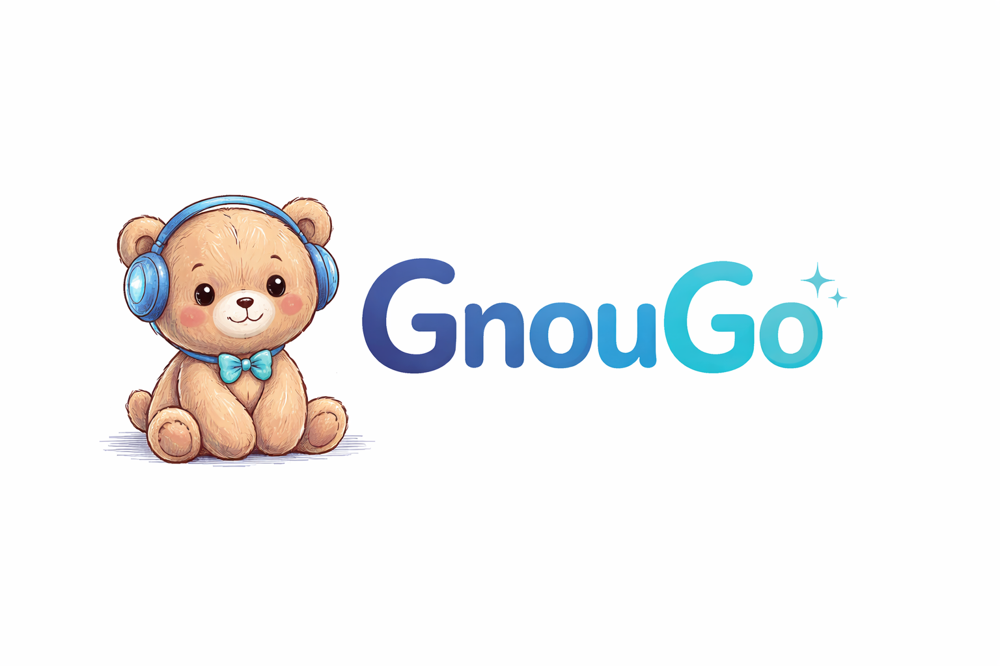

# 🐻 GnouGo : The Friendly Bear Agent

> [!WARNING]
> **WORK IN PROGRESS** — features, APIs, and project structure may still change.

GnouGos have existed forever — they are extremely kind, a little magical, and always appear at the right moment.
They possess an enormous amount of knowledge.
For them to help you, you will need to explain clearly what you want. They won't always understand on the first try,
so take the time to re-explain.

Give them clear and simple instructions and they will provide you with invaluable services.

Their main objective: your safety and saving you time!

> ⚠️ GnouGo can make mistakes. That's okay! Forgive him and rephrase your instructions more clearly. He learns better when you talk to him nicely. The more precise you are, the more effective he'll be.

---

## 🧱 Project Building Blocks

The GnOuGo project is composed of several complementary families:

| Family | Description |
|---|---|
| **GnOuGo.Agent** | End-user chat experience: local web app, desktop host, and shared contracts for the main assistant UI. |
| **GnOuGo.Flow** | Workflow automation platform: DSL execution engine, CLI/server hosting, browser automation, command execution, and workflow user data. |
| **GnOuGo.Diff** | Audit and comparison tools: revision storage, diff computation, API, UI, and sample-data utilities. |
| **GnOuGo.DocIngestor** | Document ingestion pipeline: extract, chunk, embed, and expose documents through CLI and server components. |
| **GnOuGo.KeyVault** | Secret management services: encrypted storage, tenant-aware vault features, and management APIs. |
| **GnOuGo.OtlpCollector** | OpenTelemetry ingestion stack: multi-tenant OTLP collection plus tooling to send and inspect telemetry data. |

Supporting libraries such as **GnOuGo.AI.Core**, **GnOuGo.Auth.Core**, and **GnOuGo.VectorDbDisk** provide shared AI, authentication, and storage foundations across these families.

---
