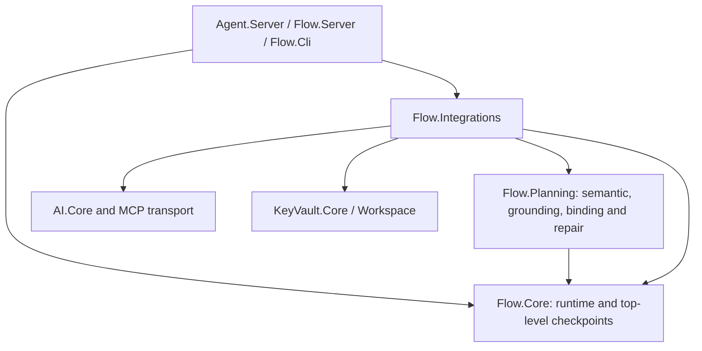
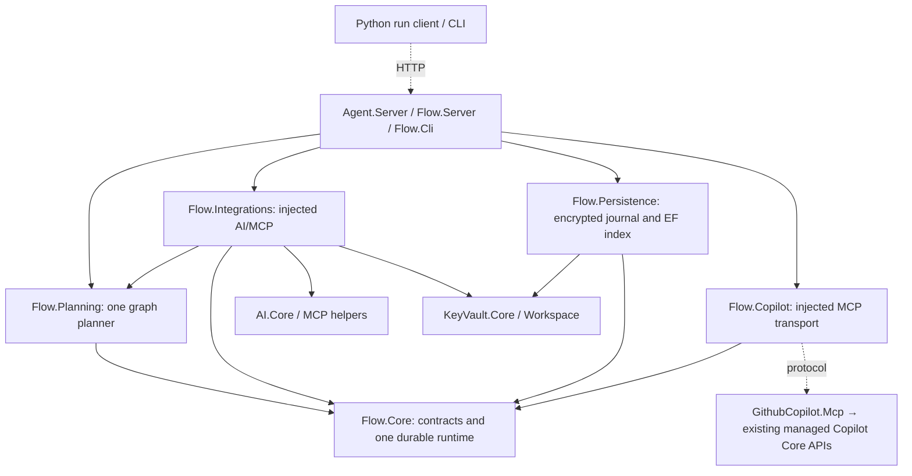

# Flow hybrid planning replacement

[Issue #112](https://github.com/GnouGo/GnouGo/issues/112) · [Draft PR #113](https://github.com/GnouGo/GnouGo/pull/113)

The implementation replaces the semantic/grounded pipeline with reviewable
requirements, progressive discovery, one executable graph and bounded graph
revision. Deterministic stages and bounded agent tasks use the same durable engine.
Schema-8 records remain untouched; their approvals cannot authorize schema-9 runs.
See [architecture, APIs and migration](workflow-planning-v9.md).

## Dependency changes

Before (arrows indicate package dependencies):

After:

Core has no outgoing dependency on another GnOuGo package. Planning and Copilot
have only Core as a GnOuGo dependency. Persistence owns EF Core and the KeyVault
record API; the rebuildable index never becomes an alternative payload store.

## Deleted subsystems

- Semantic and grounded executable representations and their serializers.
- Exhaustive catalog coverage, binding batches and persisted batch prefixes.
- Separate semantic/grounded repairs, candidate decisions and continuation DTOs.
- Mandatory model-generated scenario fixtures and production dry-run planning.
  Independent authored-YAML simulation scenarios remain in tests.
- Planning-only computation inference, its documentation wrapper, repair diagnostics
  and legacy UI fields.
- Top-level checkpoint API, routes, payloads and the duplicate resume path.
- Python demo checkpoint model/store/resume path; Python durable commands now use
  the same tenant-scoped schema-9 host API through `WorkflowRunClient`.
- Schema-8 execution support and the legacy planner switch.

Production C# under `Flow.Planning` and `Flow.Core/Planning` decreased from 55 files /
7,190 lines at the parent to 40 files / 4,400 lines. This intentionally
excludes the new execution, adapter and persistence functionality. The comparison
uses Git source files, excluding generated `obj` and `bin` files.

## Validation evidence

Parent: `46c2c77fea19c952d3258d744d886fe52ef52d33`, checked out separately before
implementation. Parent Core tests: 890 passed; Planning: 269 passed, without warnings.

The frozen comparison uses `tests/Shared/PlanningBenchmarkCases.cs`, unchanged
business requests and independent execution oracles, OpenAi `gpt-5.5-2026-04-24`,
96,000 input / 32,768 output tokens per request, eight session transport attempts,
two repairs and one shared EUR 50 campaign ceiling. Baseline: 24 live runs, three
repetitions per case, 14 correct outcomes, median four planning calls. Failed runs
are retained. The parent's `fixture` phase label permits live baseline collection
after its failed pilot; every result still records `mode: live`. It does not waive
the candidate acceptance gate.

[All original parent, pilot and candidate measurements](evidence/flow-v9-112/README.md)
are reviewable without private prompts. Candidate `87acc5f` completed all three
repetitions: 22/24 correct versus 14/24, median 2.5 calls versus four, with no per-case
regression. The retained French failure improves from 0/3 to 2/3. Every approved
workflow passes the independent execution variants with no safety violation.

The raw comparison remains inconclusive because one exhausted session's rejected
logical reservation was reported as a ninth call with unknown usage. A read-only
admission audit proves the request had no HTTP attempt and that the session ledger
contains eight admitted attempts. The audited comparison passes; its proof hashes,
raw comparison and unchanged failed outcome are retained together. Both exhausted
inconclusive sessions remain permanently closed. The complete campaign evidence
hash and accounting are unchanged by the audit. Known cost plus conservative
reservations total EUR 28.6454561388 under the unchanged EUR 50 ceiling.

Latest completed checks:

- Full solution: 2,777 tests passed; five opt-in live tests skipped; no build warnings.
- Python: 287 core and 26 CLI tests passed; both packages pass lint and build. The
  schema-9 client also passed against the published Native AOT host, including
  journal inspection, durable human answers and receipt reuse across restart.
- Agent and Flow frontends built without warnings; the corrected Flow.Server Docker
  image builds and serves its health and UI endpoints.
- Native CLI and Flow server: encrypted journal receipts, native EF query/index
  rebuilding, tenant isolation, revision conflicts, streamed human answers and
  completed-run recovery across restart passed.
- Native Copilot MCP: schema-9 protocol, unsupported-scope refusal before inference
  and failed terminal receipt round-trip passed. Published Agent server: encrypted
  planning persistence, HTTP health, static UI and Blazor negotiation passed.
- Live bounded file editing passed in both Debug and Native AOT after correcting the managed SDK mode: observed
  file changes, permission refusal, receipt reuse and rejected objective expansion.
  The command-based edit/test cycle remains blocked by host sandbox enforcement.
- Planner: 77 tests; Copilot adapter: five tests. All five affected Flow packages
  packed without warnings; package contents and independent dependency boundaries were checked.

The PR stays draft. The audited relative comparison passes, while the existing
stricter pilot/measured release gates remain unpassed. The real bounded Copilot
command edit/test cycle also remains incomplete. This Mac lacks mandatory administrator-managed
sandbox policy. An isolated non-root Linux container recognizes that policy after
the SDK bootstrap correction, but its enforcement probe fails on the available
host. The final Native AOT preflight preserves BYOK/client authentication and
reaches the expected mandatory-policy check; it no longer fails SDK session creation.
Neither host dispatches the task prompt. The adapter fails closed and
reports that distinction; a file-only, native or unit-test pass does not establish
command execution success.

Representative behavioral coverage:

| Contract | Evidence |
| --- | --- |
| Discovery, unavailable sources, exact contracts and bounded repair | `ProgressiveDiscoveryTests`, `GraphContractTests`, `GraphRevisionTests` |
| Structured outputs, fabricated claims and failed verification | `AgentTaskTests`, `BoundedCopilotTasksTests` |
| Dispatch/receipt crashes, nested calls, loops, parallel cleanup and durable answers | `WorkflowRunTests` |
| Encryption, index rebuilding, concurrent owners and tenant isolation | `EncryptedWorkflowRunStoreTests`, published-binary smoke script |
| Real model editing, refused permissions, immutable objective and receipt reuse | Debug and Native AOT controlled-edit tests; command cycle remains unpassed |

## Published persistence and framework exceptions

`scripts/verify-flow-v9-published.py` runs isolated black-box checks against published
CLI/server executables. It never uses repository databases. Authoritative payloads
are encrypted, EF Core indexes rebuild from them, and workflow markers must not be
visible in database bytes. `--planning-persistence-smoke` exercises the published
Agent server's encrypted planning store independently of HTTP startup.

EF Core 10.0.12 uses generated models and precompiled index queries. Its generator
currently emits CS8669 and CS9270 in one generated interceptor file; only that file
has those two diagnostics suppressed. Publish-only Jint 4.16.3 interop diagnostics,
EF Core package summaries, unused Spatialite discovery and DependencyContext
single-file diagnostics have exact-origin audit entries in
`verify-warning-free-publishes.ps1`. Application diagnostics are not added to that
allowlist. Audit publication enables the warnings again and rejects changed origins. The
Agent server audit was repeated against the isolated parent: 106 distinct warning
origins before, 105 after; the compiled planning model removed its application
IL2026. No additional warning origin was accepted.
