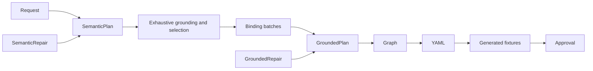
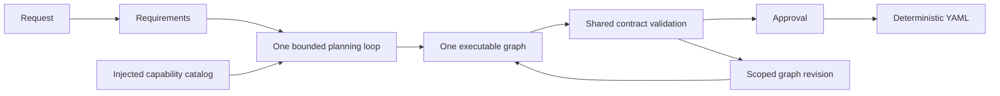

# Flow hybrid planning replacement

Issue: https://github.com/GnouGo/GnouGo/issues/112

The accepted implementation replaces the semantic/grounded planning pipeline with
requirements, progressive capability discovery, one executable graph, deterministic
validation and approval. Adaptive work belongs inside bounded agent stages.
Breaking changes remove schema-8 execution, legacy DTOs and top-level checkpointing.
Old encrypted records remain untouched.

## Parent baseline

Source: `46c2c77fea19c952d3258d744d886fe52ef52d33`.
Captured in a separate detached checkout before implementation:

- Flow.Planning: 269 tests passed.
- Flow.Core: 890 tests passed.
- Both builds completed without warnings.

These deterministic tests are not a live-model reliability measurement.
Live corpus comparison and execution acceptance remain outstanding.

## Implementation sequence

1. Provider-neutral bounded agent contracts and observed-evidence verification.
2. Canonical graph planner and progressive catalog; delete superseded models.
3. Managed Copilot adapter and encrypted durable invocation journal.
4. Host, API, UI, CLI and corpus migration; delete compatibility paths.
5. Failure injection, live comparison, packaging, published smokes and documentation.

The issue contains the complete acceptance checklist. The PR stays draft until
all required implementation and verification is complete.

## Planner replacement checkpoint

The planner now uses one graph and progressive cached discovery. Semantic and grounded models, exhaustive coverage, binding batches, separate repairs, generated scenario fixtures, candidate decisions and their UI contracts have been deleted. Authored YAML keeps its existing runtime language. New generated numeric and projection operations are registered typed executors.

Before:

After:

The draft is still incomplete: the Copilot adapter, durable execution journal, remaining host test migrations, execution UI, full package/AOT validation and live acceptance comparison are pending.

The baseline pilot reproduced a FinalReview false positive for nullable defaults and a six-call/two-repair failure for the French PR review. The unchanged parent benchmark cannot enter its `measured` phase after a failed pilot. Its existing `fixture` phase label is therefore used for the three-repetition **live baseline comparison**; `mode: live`, exact source revision, model, usage and failures remain recorded. This does not count as passing the candidate validation gate or as offline evidence. The same encrypted campaign retains the original EUR 50 ceiling.

Validation at the planner replacement checkpoint: Flow.Core behavioral tests 897/897; Flow.Planning 43/43; Flow.Integrations 79/79. Agent.Server built without warnings. Its full test run passed 391/393 after migration; the remaining two stale UI text assertions were corrected and the entire affected eight-test UI suite then passed. The normal planner smoke passed all eight frozen cases. This is not the final validation run and is not Native AOT evidence.

## Durable execution implementation

Removed `IWorkflowCheckpointer`, its in-memory implementation, top-level index checkpoints, and the duplicate resume execution path. `workflow.execute` now uses the same nested-workflow lifecycle as `workflow.call`. The journal identifies steps by workflow call path, branch, iteration and retry attempt; recorded switch/loop decisions and resolved remote workflow definitions survive recovery. Planning retries retain their original session identity and budget.

`GnOuGo.Flow.Persistence` is independently publishable. Encrypted KeyVault records are authoritative; EF Core/SQLite indexes contain only tenant/run identifiers, revision, status and timestamp. Process owner locks prevent concurrent execution, short write locks serialize commands, and cancellation/human answers merge into the active owner's next revision. Answer acknowledgement follows durable persistence. Generated EF models avoid runtime model construction; fixed index DDL runs through EF Core rather than runtime migrations. Native AOT publication remains a later validation gate.

Agent.Server, Flow.Server and Flow.Cli now inject the journal. HTTP run commands are tenant-scoped and revision-checked. CLI inspection/cancellation and `run --resume-revision` expose recovery state. Agent execution/reconciliation UI, the Copilot adapter, and published-binary tests remain outstanding.

At this implementation checkpoint: Core 901/901; Integrations 79/79; Persistence 3/3; Agent.Server 393/393. Flow.Server, Flow.Cli and Agent.Server built without warnings. Flow.Server's frontend built without warnings. Crash tests cover dispatch/receipt boundaries, nested calls, loops, parallel branches, pending human answers, cleanup exclusion, tenant isolation and concurrent owners. The frozen parent comparison completed all 24 live runs; failures are retained. Candidate live comparison is still pending.
