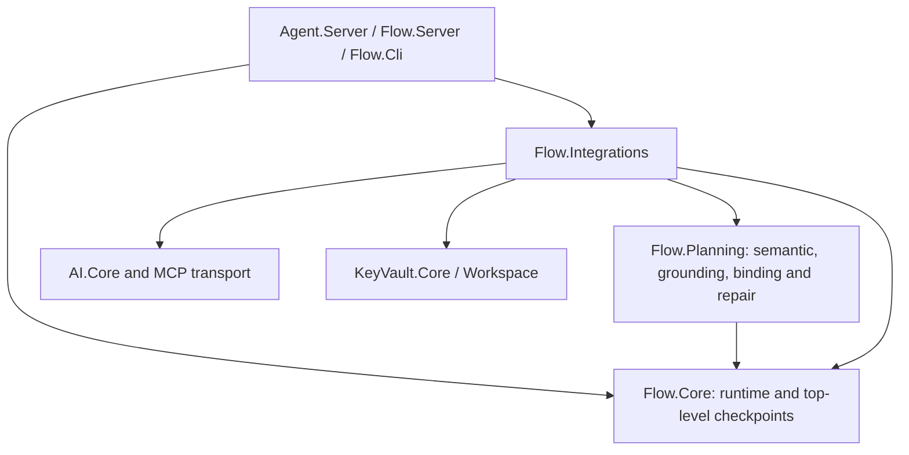
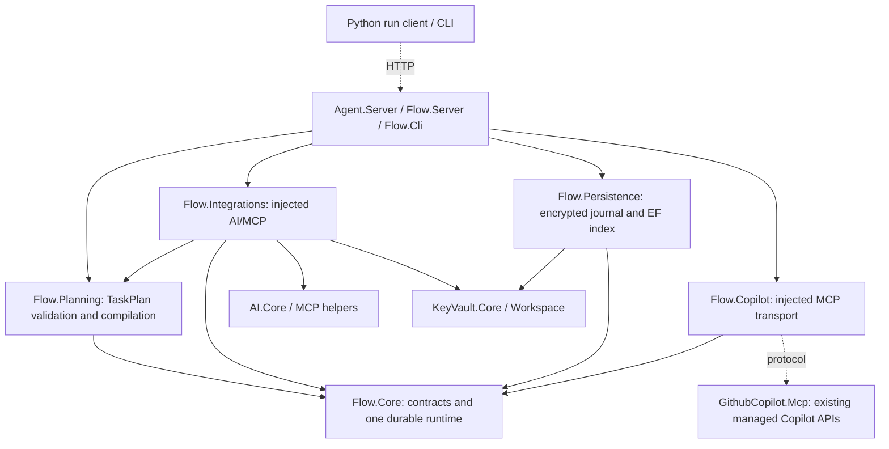
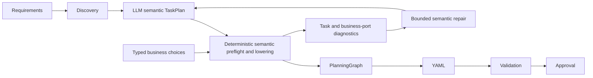

# Flow TaskPlan planning and durable execution

[Issue #112](https://github.com/GnouGo/GnouGo/issues/112) · [Draft PR #113](https://github.com/GnouGo/GnouGo/pull/113)

Current architecture: Requirements → progressive discovery → LLM TaskPlan → deterministic compiler → PlanningGraph → YAML → validation → approval. The compiler validates semantic intent before lowering. Scoped TaskPlan repair stays inside the existing bounded planning loop. Planning storage is format 10; execution journals remain schema 9. See [architecture, APIs and migration](workflow-planning-v9.md).

## Dependency boundaries

Before the replacement (arrows indicate package dependencies):

Current dependencies:

Core has no outgoing dependency on another GnOuGo package. Planning and Copilot have only Core as a GnOuGo dependency. Persistence owns EF Core and the KeyVault record API; rebuildable indexes never become an alternative payload store.

## Planning responsibilities

TaskPlan owns operation intent, business bindings, explicit scopes and branch exports. PlanningGraph remains the sole executable representation. Transient symbols and source maps point into the TaskPlan; there is no additional persisted plan or model phase.

Preflight collects independent semantic errors before emitting graph nodes. It preserves scope visibility, authoritative contracts and opaque values. The compiler owns stable IDs, executor envelopes, projections, declared branch merges, ordered collection mechanics, explicit literal defaults and cleanup guards. It never invents business exports or fallback values.

Repair permissions cover diagnosed business slots and the explicit export chains needed by their consumers. Related missing conditional declarations require explicit alternative values. Revalidation of dependent tasks grants no edit permission. Unrelated tasks, interfaces, choices, scopes and ordering remain fixed; ambiguous locations never widen permission to the whole plan. Rejected proposals preserve the baseline, receipts and cumulative budgets. Approval recompiles intent and requires the reviewed artifact to match exactly.

## Deleted subsystems and superseded behavior

- SemanticPlan/GroundedPlan executable intermediates, serializers, exhaustive catalog coverage, binding batches and separate repair pipelines.
- Direct-graph model response schemas/prompts, explicit model capability-resolution actions, graph revision baselines and model graph repair.
- YAML-to-planner revision import, free-form clarification/decision DTOs and their obsolete UI. Authored YAML remains executable.
- Mandatory model-generated scenario fixtures and planning-only computation inference. Independent test scenarios and authored-YAML expression support remain.
- Top-level checkpoint API/routes and duplicate resume paths, schema-8 execution support and the legacy planner switch.
- First-error-only semantic input checking, the unused compiler scope traversal, transitive whole-task edit permissions and the unmapped-diagnostic whole-plan repair fallback.
- Active host documentation for removed `answer_decision`/scope-consent flows, binding batches and computation-inference details; expired benchmark instructions are replaced with links to retained evidence.

The latest semantic validation/repair work changes no runtime, persistence, host security or public storage contract. Follow the [repository planning skill](../.agents/skills/gnougo-planning/SKILL.md) for future changes.

## Retained evidence and limitations

The reports below describe their pinned revisions, not the current implementation or permission to run another campaign. Historical dated `planning-*` and `planner-*` reports likewise document superseded implementations; current integration instructions are in [workflow planning](workflow-planning-v9.md).

| Cohort | Retained result |
| --- | --- |
| [Original parent and graph candidate](evidence/flow-v9-112/README.md) | Parent 14/24, candidate 22/24; full-eight-case medians 4 and 2.5 |
| [Graph stabilization](evidence/flow-v9-112/stabilization/README.md) | Conditional-case regression and all stopped/uncertain evidence retained |
| [Initial TaskPlan](evidence/flow-v9-112/taskplan/README.md) | 5/9 correct, three-call median; acceptance failed |
| [TaskPlan stabilization](evidence/flow-v9-112/taskplan-stabilization/README.md) | 8/9 correct, one-call median; agreed per-case acceptance passed |

The latest live source remains `d636c99`; its failed parallel-export repair, accounting and all previous evidence remain unchanged. Semantic preflight/repair follow-up uses deterministic tests only and makes no new live-performance claim.

Real Copilot command edit/test execution remains unverified. This Mac lacks mandatory administrator-managed sandbox policy. The prior isolated non-root Linux container recognized that policy but failed its enforcement probe on the available host. No command-task prompt was dispatched. The adapter fails closed; controlled file editing, Native AOT publication and simulated workflow success do not establish command execution. Keep the PR draft and do not bypass enforcement.

## Published persistence and framework exceptions

`scripts/verify-flow-v9-published.py` checks published CLI/server executables using isolated databases: encrypted payloads, rebuildable EF indexes, tenant isolation, receipt reuse and absence of plaintext workflow markers. `--planning-persistence-smoke` exercises the published Agent server's encrypted planning store.

EF Core 10.0.12 uses generated models and precompiled index queries. Its generator emits CS8669 and CS9270 in one generated interceptor file; only that file suppresses those two diagnostics. Publish-only Jint 4.16.3 interop diagnostics, EF Core package summaries, unused Spatialite discovery and DependencyContext single-file diagnostics have exact-origin audit entries in `verify-warning-free-publishes.ps1`. Application diagnostics must not be added to that allowlist. Audited publication restores the warnings and rejects changed origins; existing exceptions require published-binary smoke coverage.
