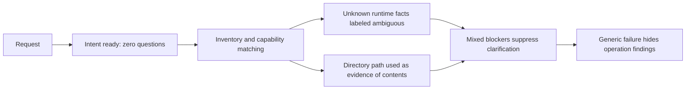
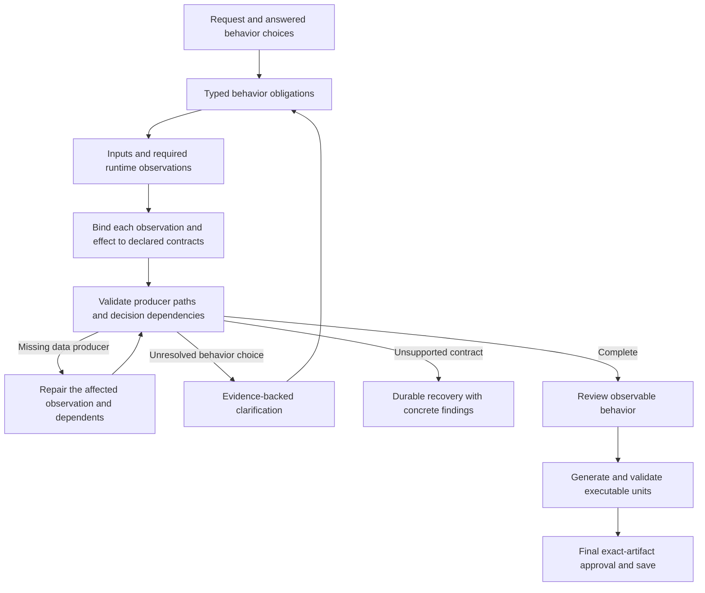

# Planner v2 capability preparation: September 7 regression

## Observed failure

Session `3dc70c726e784f7e851e53ee2421934f` used Planner v2 and the configured
`gpt-5.5-2026-04-24` model with low reasoning. It stopped in capability preparation
after 94.24 seconds of active work, seven model calls, 139,111 recorded tokens and
EUR 0.81 estimated cost. Intent assessment returned `ready` with zero questions.
No behavior or executable graph was produced.

Read-only replay of the retained matching response, against a persisted catalog
whose text exactly matches that request, reproduced three blockers:

1. Dependency installation was labeled ambiguous because the runtime resource's
   ecosystem was unknown.
2. Test execution received the same classification.
3. Conditional execution had no producer for the presence decision: its local
   decision consumed a materialized directory, not observations of its contents.

The first two are model classifications, not established user-intent ambiguities.
Choosing a framework during creation would constrain a workflow that should inspect
the supplied resource at runtime. That choice would also leave the missing observation
unresolved. A clarification helps when the requested behavior itself is undecided;
technical construction defects need repair and an understandable recovery state.

## Corrections delivered

- Failed conditional grounding preserves the declared decision edge in both parsing
  and selector normalization. Repair unlocks that edge and its declared ancestors,
  including legacy candidates that retained an attempted upstream producer.
- A rejected expanded-catalog response no longer replaces the retained candidate's
  findings with `upstream_rewind_non_improving`. Its findings are reported separately
  as a rejected attempt. A malformed repair still blocks planning.
- v2 capability inference failures enter durable `recovery`, with the concrete
  operation findings, declared decision source and missing-observation guidance.
  Confirmed unsupported capabilities retain their explicit `unsupported` outcome.
- Recovery is a human wait with no final failed outcome. Retry retains answers and
  cumulative budgets, archives diagnostics, and checks the persisted revision.
- Designer messaging identifies capability preparation before behavior review.
  It retains Edit request, Retry and Cancel without manufacturing a clarification.
- Inventory instructions now state the external-observation boundary explicitly:
  local transformations consume supplied values; they cannot read resource contents.

The recorded candidate still fails the required capability checks on read-only replay.
These changes improve construction guidance, repair targeting and recovery. They do
not establish that a fresh generation will supply the missing observation correctly.
No producer-side MCP schema discrepancy was demonstrated in this incident.

## Recommended next architecture change

Typed executable units are useful, but capability preparation still inherits the
older inventory/matching pipeline. Stabilization should extend the typed boundary
to this earlier phase:

The proposed contract distinguishes user choices, runtime observations, unavailable
capabilities and malformed model output. Each classification needs source evidence
or a declared producer reference. Missing runtime facts create observation obligations;
they never silently become generation-time constants or questions about tool names.
Unrelated valid questions and technical findings can coexist in the session without
accepting unresolved executable behavior.

Capability responses should use exact operation keys and catalog references. Changes
should target explicit fields and dependency edges, preserving satisfied obligations.
Checkpoint inventory, catalog selection and matching separately so Retry does not
repeat successful discovery and assessments. Keep required runtime observations in
the graph through behavior approval, compilation and scenario coverage.

An owned MCP may improve this boundary by exposing a read-only, typed inspection
operation. Its result should identify observations, their source paths and
unsupported/inconclusive states. Existing command execution may provide observations
through an explicit read plus validated transformation. Producer schemas must describe
actual structured results; no planner heuristic should infer semantics from a server
or tool name. A directory handle alone remains insufficient evidence.

## Validation and live acceptance

Regression coverage includes a local decision over a materializer, declared-edge
preservation during repair, rejected-repair diagnostics, mixed capability findings,
recovery/retry and stale revisions, language-equivalent requests, UI restoration,
tenant isolation and retained clarification budgets. Existing capability safety
regressions remain mandatory. Native AOT and published encrypted persistence checks
cover the affected serialization/runtime boundary.

The cumulative live ledger remains at 120 calls, EUR 68.183557 recorded/reserved cost
including the prior campaign reserve, plus EUR 31.285493 for four requests without
verified usage receipts. Its conservative remaining balance is EUR 0.530950 against
the authorized EUR 100. Neither the ledger nor unresolved reservations may be reset.
Further paid validation needs sufficient authorized budget and call allowance.

Three successful generation/save/execution runs remain an unmet acceptance gate.
Replay, a successful build, a visible recovery screen and green CI do not count as
successful live generation. The user's latest session is retained without fabricated
answers or approval.
