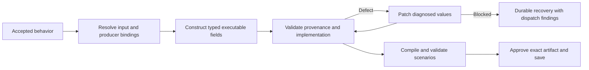

# Planner v2 data binding and repair contracts

The September 7 retained candidate referenced two undeclared fields on opaque MCP
results. Its generation request fit the 12,000 estimated-input-token limit, but its
repair request did not. Retrying repeated the local rejection without a provider
request. Human behavior approval had already occurred; a new user question could
not establish those technical fields.

## Contracts

Core owns additive `PlanningDataflowContract`, `PlanningBinding`, and construction
dispatch metadata. Snapshot schema version remains 2. Agent.Server continues to
encrypt snapshots and receipts through KeyVault and persist tenant-scoped revisions
through its EF Core/SQLite owner.

New executable model responses select exact binding identifiers. The compiler
resolves producer keys, paths and default versus structured result channels. Opaque
results expose only the whole value. Templates can serialize them; accessing an
undeclared field requires a validated transformation. Conditional children cannot
be addressed outside their execution body, and an executing container cannot be
used as a completed producer.

MCP argument responses use exact properties from the selected input contract.
Transport fields and locked request bindings are inserted deterministically. An
explicit `omit` transport value removes an optional argument; `null` remains a real
argument value and is checked against its declared schema.
Structured post-processing receives its own schema-reference index: only references
already valid for strict output are offered there. Native result annotations retain
their original producer constraints. Schema-only units defer implementation binding
checks until their owning executable unit exists.
The compiler opts into `mcp.call.preserve_optional_nulls`; existing executable YAML
keeps its previous default omission behavior unless that option is explicitly set.

Computations receive named bindings and use those parameters in executable
JavaScript expressions. Undeclared context identifiers are rejected. Business input
dependencies are visible in new behavior reviews and checked transitively during
implementation. Older approved plans resolve missing dependency metadata from
their retained input/operation descriptions, with exact source excerpts and a
bounded evidence repair. This does not rewrite the accepted behavior hash.

## Recovery

Repairs use validator-selected value coordinates, including values nested inside
templates and argument objects. Patches apply atomically and cannot replace unrelated
fields. Their context excludes the surrounding template and unrelated producer
schemas. Oversized patches are divided into smaller field groups; limits are never
silently raised and schemas are never weakened to fit.

The default limits remain four nodes per executable unit, four concurrent calls,
12,000 estimated input tokens and 8,192 maximum output tokens. Size rejections occur
before dispatch and consume no model or repair call. The UI displays actual envelope
size, configured limit, repair calls and dispatch outcome above the diagram.

Contract upgrades revalidate retained candidates and preserve cumulative receipts,
answers and approvals. A new validation pass has its own bounded repair allowance;
previous successful repairs remain in cumulative counters. Valid candidates can be
revalidated without another model request. An unchanged deterministic size blocker
explains why an identical Retry cannot progress.

Later runtime findings use the same value-coordinate repair path. Nested templates
are lowered and checked before unit acceptance. A finite selector computation is
accepted only when deterministic syntax analysis proves every possible returned
scalar belongs to its declared enum; unknown results and locked literal-binding
violations remain errors.

Behavior validation also checks required native capabilities and artifact
materialization occurrence counts. An artifact-producing capability cannot be used
again as a different lifecycle action. If a corrected validator finds an invalid
previously approved behavior, Retry retains its encrypted history and requests a
new behavior review. It does not carry the invalid approval into a saved artifact.
V2 capability inventory retains source-addressed lifecycle evidence across
languages, without the compatibility planner's English keyword filters.

## Validation and campaign accounting

Regression tests cover opaque results, invalid binding IDs, conditional scope,
large-template leaf repairs, typed computation parameters, dynamic runtime inputs,
optional omission versus null, evidence repair and durable dataflow serialization.
Simulated execution remains separate from live external acceptance.

An existing live campaign can amend only its money and call limits using an explicit
authorization flag (`GNOU_GO_LIVE_INTENT_AGENT_AMEND_AUTHORIZED_LIMITS=1`). The
existing campaign lease protects the update. The same ledger retains usage, exchange
rates, unresolved reservations and an append-only amendment history. Changes to
provider attestation, prior reserves, token limits or currencies still fail closed.
Provider receipts are required to release an unresolved reservation.
`TypedWorkflowPlanning:MaxModelCalls` defaults to 100. The campaign host explicitly
uses the authorized campaign call limit while retaining per-session usage and the
outer cumulative ledger; changing this setting never resets receipts.

The recovery harness starts embedded MCP listeners with
`TypedWorkflowPlanning:BackgroundProcessingEnabled=false` and submits commands only
for the requested session. Normal server operation leaves this setting at `true`.

Three independent generation-and-save runs and the disposable-fixture execution,
confirmation and cleanup checks remain required before recording live acceptance.
Neither a recovery screen nor green CI establishes live generation success.
