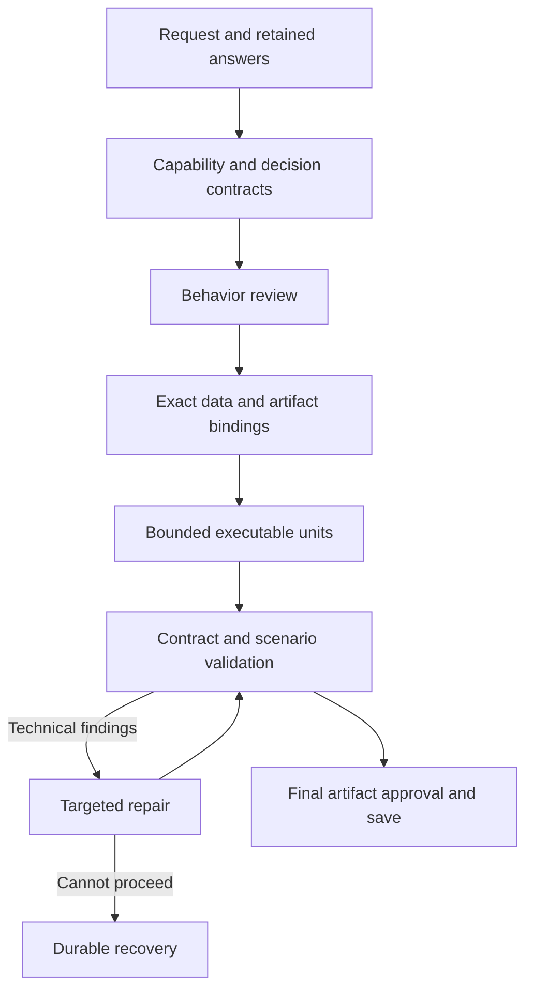

# Planner v2: decisions and permission

Planner v2 resolves the result to publish separately from permission to publish it. A human confirmation is a native `human.input` operation in `confirm` mode: its successful result contains a boolean `response`. Labels never change this type. An analysis result cannot stand in for a declared confirmation.

`PlanningDecisionContract` records the decision source operation, capability, pointer, result type, finite outcomes, input dependencies and affected operations. `PlanningInteractionContract` records the native interaction contract. The compiler lowers permission to a strict boolean mapping: only `response === true` chooses the effect. Rejection, abandonment, missing results, malformed responses, timeout and cancellation cannot authorize publication. Execution confirmation is separate from creating or approving an agent.

The planner supplies confirmation routing; construction responses have no editable selector field for that routing. A declared native reducer preserves its required human dependencies independently of generated outcome predicates. Capability matching uses exact operation keys and status-specific cardinality; it cannot introduce a substitute decision source.

Each capability retains its locked upstream operation dependencies. Executable-unit checks reject unrelated producer results before final assembly, including through aliases, loop bodies and accepted decision guards. Reducer repair reconstructs the typed condition slots and retains human-review context; repeated repair does not accumulate permission wrappers.

Artifact identity follows original declared producers through transparent aliases, native containers and explicit workflow arguments. Matching scalar types and model-produced copies do not establish identity. Availability checks still apply before selecting any binding. Each node receives only the bindings available in its own execution scope. A failure fallback that loses a required original artifact is diagnosed at the producer, before its consumer is generated.

Repairs retain unrelated fields. Diagnostic coordinates are resolved against the retained candidate, including its argument member order, instead of an older graph or empty skeleton. A structural finding on an object permits replacement of that object; narrowing it to scalar leaves would prevent repairing incorrect member names. `set` results are checked during unit validation against their declared computation contract. Deterministic units emit only their required empty fields; an unchanged local construction failure enters recovery without a model call or repeated revision loop.

Nominal scenario inputs are separate encrypted validation fixtures. The planner constructs literal examples against the declared inputs, with a bounded repair and the existing context/output limits. A request and input-contract fingerprint permits reuse after restart. These examples never become YAML defaults or external arguments. This avoids asking executable repair to accept an invalid generic string placeholder as a URL. Synthetic path coverage still does not prove live external behavior.

Candidate retention records the scenarios that passed for the retained graph. A repair can expose a later failure while preserving all previously passed scenarios; moving the diagnostic location alone is not regression. A rejected candidate's scenario results are kept separate from the retained graph's results. Nested execution errors target the innermost failing operation instead of its immutable routing container.

Semantic assessment has its own two-call allowance covering response shape and evidence validation. Workflow identifiers are constrained by the response schema. Invalid evidence repairs the assessment, then pauses in semantic-review recovery if unresolved; it never grants permission to patch the executable graph.

Behavior assessment repair constrains input dependencies to declared business-input names and retains the invalid candidate across Retry. Producer step keys cannot masquerade as workflow inputs, and ordinary computations cannot select workflow identifiers as producer values.

Semantic findings select exact operation/field locations. A finding about iteration, ordering or other behavior structure returns through a revised behavior plan and a new exact approval. Accepted answers, capability preparation and cumulative usage remain intact. This prevents a field repair from silently changing operation cardinality.

Loop setup is generated before its body. Typed `loop_item` and `loop_index` bindings identify an exact ancestor loop and are offered only inside its body. Item schemas come from `input.items`; generated variable names are deterministic and distinct for nested loops. Existing explicit variable names remain supported when compiling existing graphs. Native sequential count/while loops expose their declared `index_var` consistently with collection loops.

## Recovery and persistence

Snapshots retain `schemaVersion: 2`. Optional preparation checkpoints retain discovery, validated inventory, selected capability contracts, the current matching candidate, diagnostics and request fingerprints. A retained candidate is always revalidated; its presence is not proof of validity. Request/configuration fingerprints invalidate incompatible active checkpoints while encrypted revision history and cumulative usage remain intact.

`IPlanningRuntime.AdvancePreparationAsync` lets the host checkpoint preparation through the existing encrypted session store. Waiting in recovery does not consume active planning time. Retry resumes retained preparation; it never asks the user to choose an answer for an unresolved technical contract. A genuinely unresolved observable behavior still requires clarification.

The designer shows the current preparation stage, answered clarification forms and recovery findings above the diagram. Session DTOs and content-free telemetry include preparation stage and decision-contract version/count. Existing executable YAML and explicit v1 rollback remain supported.

## Validation and live campaign

Run the Flow, Flow.Planning and Agent.Server test projects for decision resolution, deterministic routing, recovery and persistence coverage. Live validation remains opt-in through `LiveIntentAgentGenerationTests`; user-session recovery never submits their answers or approval. Separate test sessions script decisions for the disposable fixture.

The authorized cumulative campaign ceilings are EUR 300, 3,000 calls and 20 million tokens. Ledger amendments preserve previous charges and unresolved reservations. The existing KeyVault configuration is authorized; this does not assert a provider-enforced spending cap. The harness enforces reservations and configured output ceilings before dispatch, with hidden transport retries disabled.

Success requires three complete generation/save runs and fixture execution, publication-confirmation and cleanup checks. Recovery, a successful model response or green CI alone is not live acceptance.

An optional `GNOU_GO_LIVE_TYPED_PLANNING_COHORT` suffix starts separate acceptance sessions while retaining the same cumulative ledger. The durable campaign store retains encrypted revisions and receipts. Failure archival copies current snapshots only; it must not load all historical payloads or hide the original failure behind an archive error.
