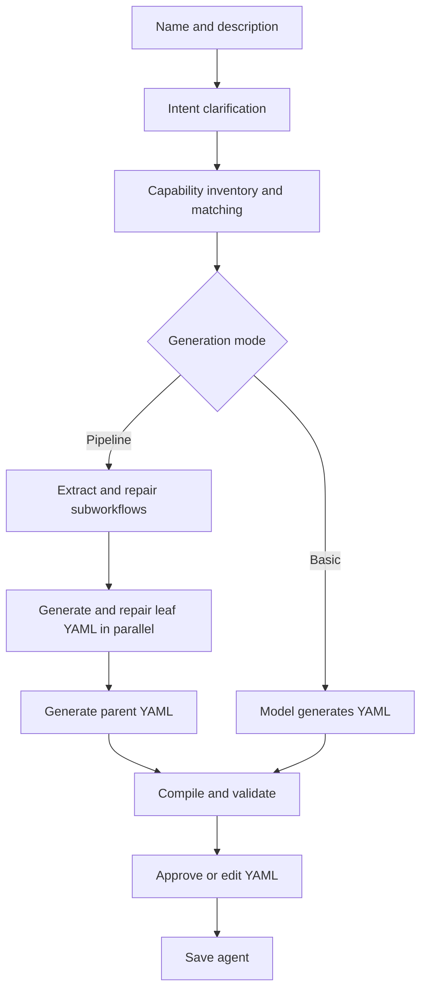
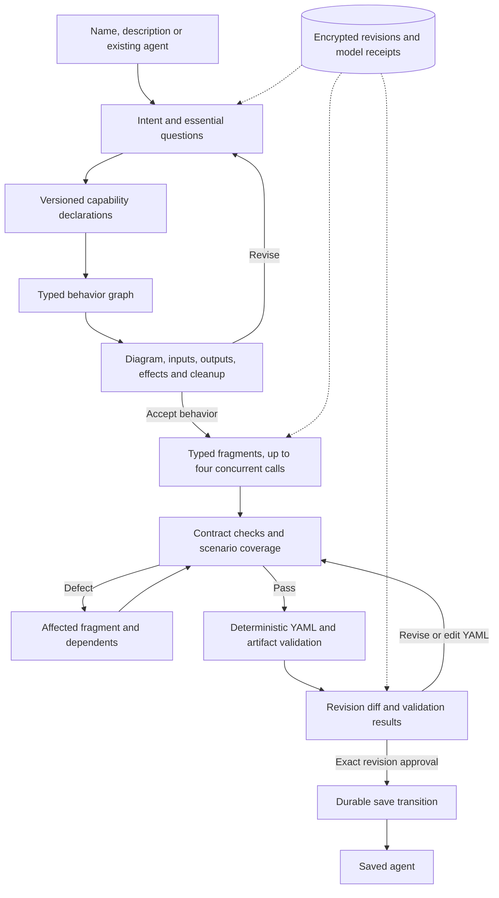

# Typed workflow planning rollout

Version 2 is an explicit alternative to the existing planner. Existing executable
YAML needs no migration. `workflow.plan` defaults to version 1; version 2 requires
an injected `IWorkflowPlanner`. Failures never silently fall back to version 1.

The existing generation path remains available:



The version-2 host path is:



| Component | Owns |
| --- | --- |
| Flow.Core | Planning interfaces/contracts, runtime adapter, compiler and established validators |
| Flow.Planning | State machine, typed JSON schemas, ownership checks, deterministic lowering, repairs and review formatting |
| Flow.Integrations | Existing provider transports, MCP adapters and provider-neutral usage estimators |
| Agent.Server | Background coordination, EF Core indexes, encrypted KeyVault payloads/receipts, HTTP DTOs, Blazor review and saving |

Open `/planning` or `/planning/{sessionId}`. The combined entry form supports new
agents and revisions. Reviews show the actual graph, external-effect classifications
from the validated intent contract, execution-time confirmations, inputs/outputs and
finalization. Natural-language changes are persisted before asynchronous model work.
Existing YAML is imported deterministically before model work; unsupported executable
constructs produce an explicit diagnostic. The imported graph supplies the original
behavior for capability resolution and revision review.
Reconnect loads the current revision; restart requeues unfinished sessions. Questions
remain pending until an explicit response arrives.

`GET /api/planning`, `GET /api/planning/{id}`, `POST /api/planning`, and
`POST /api/planning/{id}/commands` expose additive Agent.Shared DTOs. Commands carry
`expectedRevision`; approvals also carry `artifactHash`. The server's configured
execution tenant determines ownership, never a request-body tenant identifier.

Session metadata uses an Agent.Server-owned EF Core/SQLite database. Sensitive
payloads, immutable revisions, pending changes and model receipts use public generic
KeyVault record APIs. Operational telemetry contains no planning content. Paths use
`GnOuGoWorkspace`. Completed model receipts replay without dispatch or duplicate budget
charges. An interrupted request without a completion receipt fails closed as
unverifiable usage; provider completion cannot be guaranteed across network failure.

Approval binds both revision and artifact hash. Catalog declaration changes invalidate
acceptance. Saving first persists a `saving` transition, checks the existing agent
against the original artifact, and reconciles a committed save after a host crash.
Agent.Mcp's existing agent-file writer retains its existing concurrency semantics;
planning revision guards protect planner commands.
If a declared contract changes after approval, saving invalidates that approval and
returns the session to a state where it can be revised against the current catalog.

Metrics separate planning phases, session queueing, provider duration, human waiting
and final outcomes. GenAI token usage is recorded once per dispatched model request.
Historical trace summaries derive final status from captured roots and expose recovered
child errors separately; missing explicit root completion produces `unknown`.

After acceptance, route `/gnougo add` and `/gnougo reprompt` to the designer:

```json
{"TypedWorkflowPlanning":{"PlannerVersion":2,"MaxConcurrency":4,"DatabasePath":".GnOuGo/data/gnougo-planning.db"}}
```

The checked-in default remains version 1 until live acceptance. Direct designer
sessions explicitly use version 2. Rollback changes the setting to 1 without deleting
sessions or rewriting agents.

```sh
dotnet test tests/GnOuGo.Flow.Tests/GnOuGo.Flow.Tests.csproj
dotnet test tests/GnOuGo.Flow.Planning.Tests/GnOuGo.Flow.Planning.Tests.csproj
dotnet test tests/GnOuGo.Agent.Server.Tests/GnOuGo.Agent.Server.Tests.csproj -p:SkipBundledMcpTools=true
corepack pnpm --dir src/GnOuGo.Agent.Server/ClientApp build
python3 -m unittest discover -s tests/planning_benchmarks -v
dotnet publish src/GnOuGo.Agent.Server -c Release -r osx-arm64 --self-contained true \
  -p:PublishAot=false -p:PublishTrimmed=true -p:PublishSingleFile=true \
  -p:SkipClientBuild=true -p:SkipBundledMcpTools=true -o /tmp/planning-server
/tmp/planning-server/GnOuGo.Agent.Server --planning-persistence-smoke /tmp/planning-store
```

The persistence smoke uses only the supplied directory and does not start services.
Agent.Server retains its existing Blazor/EF partial-trim boundary. Regenerate the
planning EF model after index changes with:

```sh
dotnet ef dbcontext optimize --project src/GnOuGo.Agent.Server --context PlanningDbContext \
  --output-dir Planning/CompiledModels --namespace GnOuGo.Agent.Server.Planning.CompiledModels
```

The design-time factory uses an in-memory connection and never starts the application.
The [acceptance corpus](../evaluations/workflow-planning/README.md) defines the paired
20 × 3 experiment. The 95% quality, 25% active-time reduction and 30% input-token
reduction gates are targets, not measured claims. Evaluate them with frozen contracts,
the same model and independent intent checks before changing defaults.
