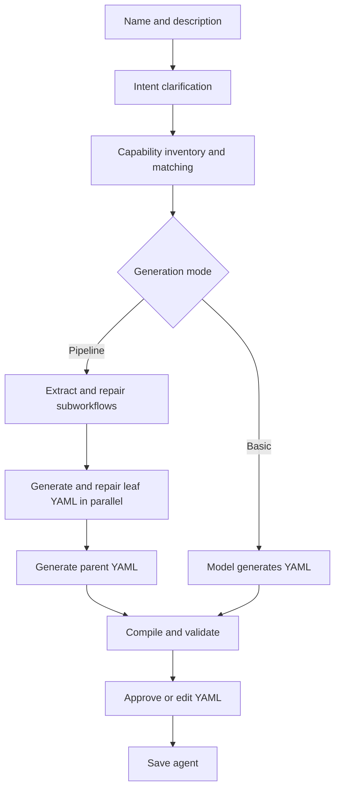
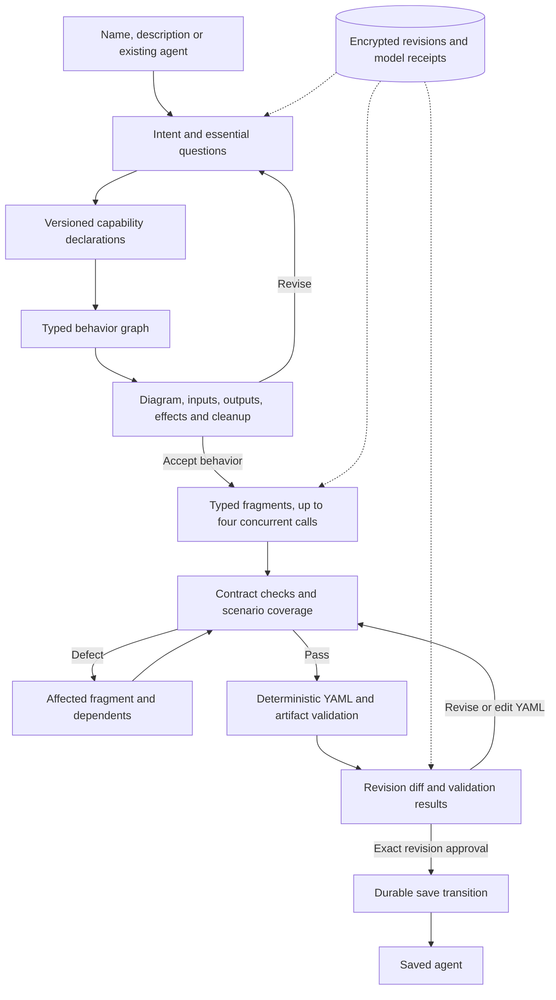
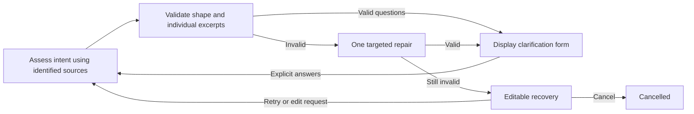
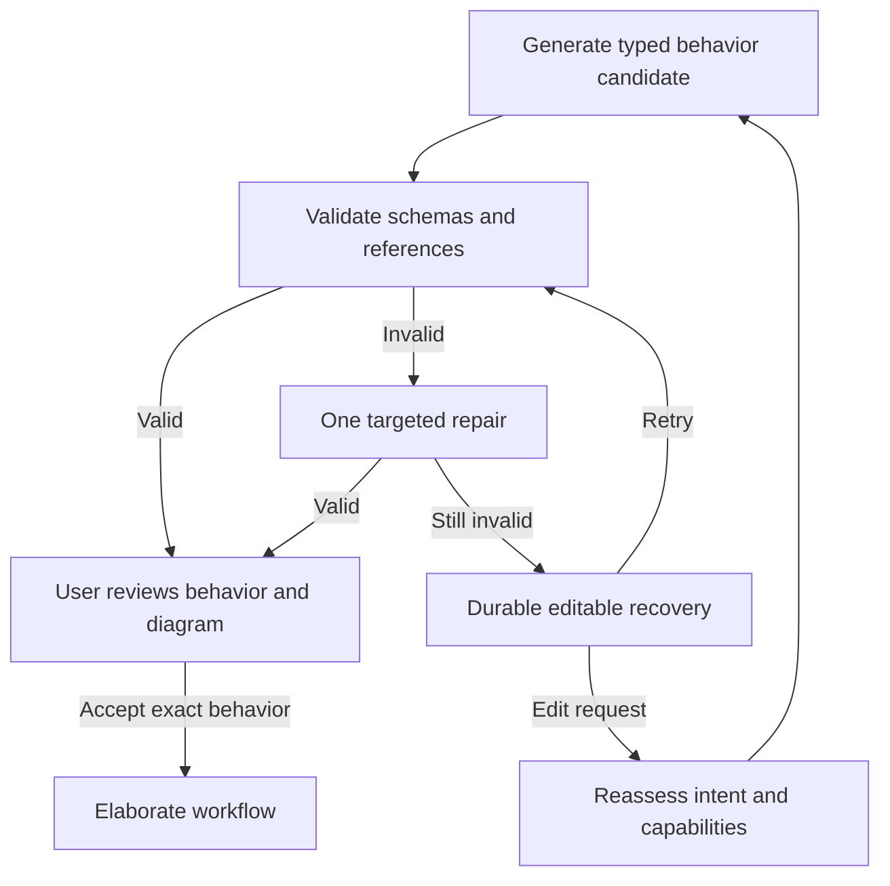

# Typed workflow planning rollout

Version 2 is an explicit alternative to the existing planner. Existing executable
YAML needs no migration. `workflow.plan` defaults to version 1; version 2 requires
an injected `IWorkflowPlanner`. Failures never silently fall back to version 1.

The existing generation path remains available:



The version-2 host path is:



| Component | Owns |
| --- | --- |
| Flow.Core | Planning interfaces/contracts, runtime adapter, compiler and established validators |
| Flow.Planning | State machine, typed JSON schemas, ownership checks, deterministic lowering, repairs and review formatting |
| Flow.Integrations | Existing provider transports, MCP adapters and provider-neutral usage estimators |
| Agent.Server | Background coordination, EF Core indexes, encrypted KeyVault payloads/receipts, HTTP DTOs, Blazor review and saving |

Open `/planning` or `/planning/{sessionId}`. The combined entry form supports new
agents and revisions. Reviews show the actual graph, external-effect classifications
from the validated intent contract, execution-time confirmations, inputs/outputs and
finalization. Natural-language changes are persisted before asynchronous model work.
Existing YAML is imported deterministically before model work; unsupported executable
constructs produce an explicit diagnostic. The imported graph supplies the original
behavior for capability resolution and revision review.
Reconnect loads the current revision; restart requeues unfinished sessions. Questions
remain pending until an explicit response arrives.

The designer displays **Planner v2** and the current phase. Invalid clarification
responses no longer close the session before the user sees a form:



Evidence is an array of `{sourceId, excerpt}` objects, independently checked against
request, answer, existing-workflow or host-constraint text. Model-authored questions
are explanatory context only. Shape, identifiers, options, evidence and cumulative
clarification limits are checked before displaying a form. There are at most two model
calls per assessment across all validation failures. Repair diagnostics identify fields;
valid questions, options and outcomes cannot be silently changed or discarded.

`recovery` is a durable waiting status, not a final failed outcome. The designer offers
**Edit request**, **Retry**, and **Cancel**, with readable findings. `edit_intent` uses
the existing command `text` and `expectedRevision` fields and is available before the
first behavior approval during recovery or early failure, including an invalid retained graph. It archives replaced answers and
diagnostics and invalidates derived planning state. Session identity, model settings,
policies, usage, encrypted history and cumulative clarification limits remain intact.
Retries archive and clear active diagnostics. Editing cannot replenish spent budgets.
Recovery waiting is excluded from active planning time.

Behavior construction has its own two-call assessment limit across shape and semantic
validation. Generation receives an exact capability/schema reference index; all ports,
node schemas, structured-output configurations and typed producer references are
validated before review. A targeted repair preserves unrelated nodes and obligations.
Exhaustion pauses in `recovery` with phase `behavior`, an explicitly unvalidated
candidate, and no artifact approval. Retry routes unreviewed candidates back through
behavior review. Technical schema defects do not manufacture intent questions.



Typed output references support optional `resultChannel`: null or `default` preserves
existing addressing; `structured` selects the validated post-processing `.json` result.
Original capability fields remain distinct. Reference schemas cannot override their
selected declaration with inline properties or other constraints.

Snapshots retain `schemaVersion: 2`. `behaviorAssessmentCalls` defaults to zero when absent. Missing `currentPhase`, `clarificationForms` and
`clarificationQuestions` fields are compatible with older snapshots; counters derive
from retained answers and pending questions when first advanced. Existing failed
sessions can be retried without migration. DTOs expose planner version and phase.
Operational spans contain session ID, revision, version, phase, diagnostic codes and
repair outcome; prompts and responses are encrypted through public KeyVault records.

`GET /api/planning`, `GET /api/planning/{id}`, `POST /api/planning`, and
`POST /api/planning/{id}/commands` expose additive Agent.Shared DTOs. Commands carry
`expectedRevision`; approvals also carry `artifactHash`. The server's configured
execution tenant determines ownership, never a request-body tenant identifier.

Session metadata uses an Agent.Server-owned EF Core/SQLite database. Sensitive
payloads, immutable revisions, pending changes and model receipts use public generic
KeyVault record APIs. Operational telemetry contains no planning content. Paths use
`GnOuGoWorkspace`. Completed model receipts replay without dispatch or duplicate budget
charges. An interrupted request without a completion receipt fails closed as
unverifiable usage; provider completion cannot be guaranteed across network failure.

Approval binds both revision and artifact hash. Catalog declaration changes invalidate
acceptance. Saving first persists a `saving` transition, checks the existing agent
against the original artifact, and reconciles a committed save after a host crash.
Agent.Mcp's existing agent-file writer retains its existing concurrency semantics;
planning revision guards protect planner commands.
If a declared contract changes after approval, saving invalidates that approval and
returns the session to a state where it can be revised against the current catalog.

Metrics separate planning phases, session queueing, provider duration, human waiting
and final outcomes. GenAI token usage is recorded once per dispatched model request.
Historical trace summaries derive final status from captured roots and expose recovered
child errors separately; missing explicit root completion produces `unknown`.

Agent.Server uses these defaults to route `/gnougo add` and `/gnougo reprompt` to the designer:

```json
{"TypedWorkflowPlanning":{"PlannerVersion":2,"MaxConcurrency":4,"DatabasePath":".GnOuGo/data/gnougo-planning.db"}}
```

Agent.Server defaults to version 2 for `/gnougo add` and `/gnougo reprompt`; these
commands open the designer. Direct designer sessions explicitly use version 2.
Standalone `workflow.plan` callers still default to version 1. Rollback changes
the Agent.Server setting to 1 and requires a restart, without deleting
sessions or rewriting agents.

```sh
dotnet test tests/GnOuGo.Flow.Tests/GnOuGo.Flow.Tests.csproj
dotnet test tests/GnOuGo.Flow.Planning.Tests/GnOuGo.Flow.Planning.Tests.csproj
dotnet test tests/GnOuGo.Agent.Server.Tests/GnOuGo.Agent.Server.Tests.csproj -p:SkipBundledMcpTools=true
corepack pnpm --dir src/GnOuGo.Agent.Server/ClientApp build
python3 -m unittest discover -s tests/planning_benchmarks -v
dotnet publish src/GnOuGo.Agent.Server -c Release -r osx-arm64 --self-contained true \
  -p:PublishAot=false -p:PublishTrimmed=true -p:PublishSingleFile=true \
  -p:SkipClientBuild=true -p:SkipBundledMcpTools=true -o /tmp/planning-server
/tmp/planning-server/GnOuGo.Agent.Server --planning-persistence-smoke /tmp/planning-store
```

The persistence smoke uses only the supplied directory and does not start services.
It verifies recovery, clarification counters and private revision history after reopen.
Agent.Server retains its existing Blazor/EF partial-trim boundary. Regenerate the
planning EF model after index changes with:

```sh
dotnet ef dbcontext optimize --project src/GnOuGo.Agent.Server --context PlanningDbContext \
  --output-dir Planning/CompiledModels --namespace GnOuGo.Agent.Server.Planning.CompiledModels
```

The design-time factory uses an in-memory connection and never starts the application.
The [acceptance corpus](../evaluations/workflow-planning/README.md) defines the paired
20 × 3 experiment. The 95% quality, 25% active-time reduction and 30% input-token
reduction gates are targets, not measured claims. Evaluate them with frozen contracts,
the same model and independent intent checks. Enabling the designer by default does
not establish that these gates have passed.

## Opt-in live clarification and generation validation

The existing `LiveAgentAddSmokeTests` and compatibility intent harness explicitly use
v1. `LiveIntentAgentGenerationTests.TypedV2_*` exercises the durable v2 service, renders
real questions with the Blazor component, and uses the configured model unchanged.
The campaign uses isolated temporary planning storage for three generation-and-save
runs, then the existing disposable GitHub fixture execution and cleanup. Any recovery,
unsupported contract or failed downstream validation blocks success.

Both v2 entrypoints retain the existing live harness prerequisites: verified isolated
provider credential/project, provider-side hard spending limit, and one persistent
redacted cumulative budget ledger. Set `GNOU_GO_LIVE_INTENT_AGENT_BUDGET_AMOUNT=100`
and currency `EUR` for the authorized campaign; do not create a fresh ledger to reset
spending. See the [server live validation prerequisites](../src/GnOuGo.Agent.Server/README.md).
The v2 generation campaign runs three requests directly after the provider probe; the
v1 diagnostic-generation prerequisite remains specific to the compatibility harness.

```sh
# Only after the existing isolated-project and provider-limit prerequisites are verified:
GNOU_GO_LIVE_TYPED_PLANNING_RESUME=1 \
GNOU_GO_LIVE_TYPED_PLANNING_SESSION_ID='<existing-session-id>' \
dotnet test tests/GnOuGo.Agent.Server.Tests --filter 'FullyQualifiedName~TypedV2_ResumeFailedSession'

GNOU_GO_LIVE_TYPED_PLANNING_E2E=1 \
dotnet test tests/GnOuGo.Agent.Server.Tests --filter 'FullyQualifiedName~TypedV2_GeneratesAndSavesThreeAgents'
```

Recovery validation uses the existing tenant-scoped session without starting background
workers, resumes only the explicitly selected session, and verifies persisted questions
or behavior review render. It submits no answers or approvals. Reopen
`/planning/{sessionId}` in the updated server to continue the pending review.
The generation harness answers only its separate temporary sessions with scripted
fixture requirements. A visible clarification is not counted as completed generation.
