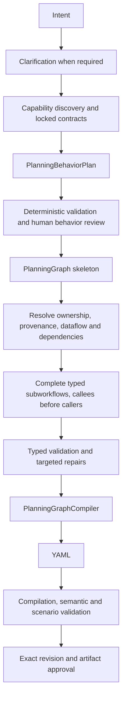

# Deterministic workflow planning

`GnOuGo.Flow.Planning` is the single Planner v2 implementation. It is a separately
publishable package depending only on Flow.Core. Concrete model and MCP clients
are supplied by integrations and hosts. Flow.Core owns provider-neutral contracts,
runtime validators, and the thin `workflow.plan` executor.



## Session and construction

`IWorkflowPlanner.AdvanceAsync` advances one explicit session transition.
`TypedWorkflowPlanner` delegates intent assessment, capability preparation, behavior
review, dataflow resolution, workflow construction, repair acceptance and executable
validation to cohesive components. `PlanningGraph` is the authoritative executable
model. Intent, construction and validation state hold phase evidence and fingerprints.
YAML is a derived, read-only artifact produced by `PlanningGraphCompiler`.

Every model response has a strict typed JSON schema. Every classification and contract
must have deterministically validated evidence from intent, declared schemas or
provider-neutral metadata. Missing evidence requires eligible human clarification or
stops the session. Provider names, tool names and domain vocabulary never establish
execution authority. Saved YAML is imported once as a validated revision baseline;
capabilities are rediscovered before granting execution authority. Execution failure
evidence is kept separate from user intent.

Human acceptance of the exact business behavior precedes executable construction.
Dependencies include workflow calls inside branches, loops and finalizers. Missing
targets and cycles stop before dispatch. Each construction request generates exactly
one complete `PlanningWorkflow` JSON object. Independent ready workflows run up to
the concurrency ceiling; callers wait for validated callee contracts. Workers receive
immutable requests, and the coordinator commits results in stable workflow order.

Requests contain only relevant accepted behavior, typed fields, native and capability
contracts, callee boundaries and diagnostics. Repeated contract objects are shared.
Construction and repair share the same scoped callee input/output boundaries;
callee implementations are excluded. Call and control-flow result contracts are
derived. Direct typed call references select a declared output port, while calls
inside collected loop results retain their runtime `outputs` envelope.
Raw YAML, unrelated workflows and previous attempts are excluded from construction.
Oversized requests and truncated responses pause with actionable diagnostics.

## Repairs and validation

One repair engine applies atomic patches to diagnosed typed fields. The graph is
staged and revalidated before commit. Global or unlocated findings grant no repair
scope. Accepted behavior, capability ownership, confirmations, finalizers, proven
provenance and validated contracts are preserved. Producer defects are repaired
before callers; changed producer contracts invalidate dependent callers.

Validation gates are typed contracts, deterministic lowering/runtime compilation,
scenarios, and semantic review. A repair must advance the first failing gate or
strictly reduce its required findings without adding failures at that gate. Earlier
passes and passing scenarios against unchanged fixtures must survive. No-op,
repeated and regressing candidates are rejected while retaining the previous graph.
Governing behavior or capability changes require renewed human review.

Repair response schemas enumerate the exact permitted workflow, node and field
coordinates and omit unused definitions. An output-value finding permits only that
value to change. Native argument diagnostics preserve unchanged members by name,
including when removing an invalid argument shifts their serialized positions.
Retrying a stopped repair revalidates the retained graph to recover its diagnostics;
it preserves the consumed allowance and durable requests.

Final approval targets the exact revision and artifact hash, after current-catalog,
compilation, semantic and scenario checks. Validation evidence is bound to graph,
locked-contract and fixture fingerprints. YAML cannot be edited during review.
Runtime expressions and WFScript remain supported, with their existing sandbox.

## Persistence, budgets and hosts

Agent.Server persists schema **3** snapshots in encrypted KeyVault records with
tenant-scoped EF Core/SQLite indexes. The default workspace-resolved database is
`.GnOuGo/data/gnougo-planning-v3.db`; snapshot, request, receipt and budget namespaces
are versioned together. Older storage is unused. Optimistic revisions, cancellation,
restart recovery, original-workflow save conflicts and human-wait accounting remain.

Each request has a durable identity covering session, phase, workflow, attempt and
request hash. Reservations are persisted before dispatch; completed encrypted receipts
are replayed after restart. Unverifiable dispatches stop without redispatch or budget
reset. Call, token, monetary, active-time and concurrency limits remain enforced.
Defaults are concurrency **4**, repair allowance **3**, input ceiling **12,000** tokens
per request and output ceiling **8,192** tokens.

Agent.Server, Flow.Cli and Flow.Server inject the same planner and runtime factory.
A host that omits injection fails explicitly. `/gnougo add` and `/gnougo reprompt`
open the designer. SmartFlow **Improve** creates a persisted revision session from
the saved workflow and execution failure evidence, then links to the designer.
Telemetry reports phases, workflows, dependencies, repairs, validations, budgets and
receipts with tenant propagation and content redaction.

## Validation commands

```sh
dotnet test tests/GnOuGo.Flow.Planning.Tests
dotnet test tests/GnOuGo.Flow.Tests
dotnet test tests/GnOuGo.Agent.Server.Tests
dotnet build GnOuGo.Agent.sln -warnaserror
dotnet test GnOuGo.Agent.sln --no-build
dotnet pack src/GnOuGo.Flow.Planning -c Release -warnaserror
dotnet publish tests/GnOuGo.Flow.Planning.Smoke -c Release -r osx-arm64 -o /tmp/planning-smoke
/tmp/planning-smoke/GnOuGo.Flow.Planning.Smoke
```

The planning smoke uses native typed fixtures and exercises the published runtime.
See its README for narrowly scoped, dependency-specific Jint publish exceptions.
Agent.Server's published `--planning-persistence-smoke` exercises encrypted EF-backed
persistence, optimistic revisions and tenant isolation.

Standalone Flow runtimes use the same planner with
`GnOuGo.Flow.Integrations.Planning.WorkflowPlanningRuntimeFactory`. It holds an exclusive
tenant/session lease and persists encrypted snapshots, requests, receipts, and budgets through
KeyVault's record API. The CLI exposes `--run-id` to reopen planning state. Agent.Server's
designer keeps its tenant-scoped EF indexes and optimistic revisions. The Python runtime
executes saved workflows; planning is provided by the .NET hosts.
