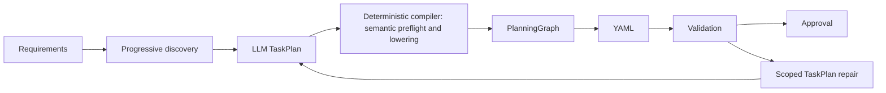

# TaskPlan planning format 10 and execution schema 9

Flow uses one semantic planner, one executable graph and one execution journal.



The model selects declared operation intents and connects business ports. The compiler
owns binding and executor plumbing. There is no model-generated graph, separate
binding session, grounded-plan representation or additional model phase.

Task, group and choice declarations share one case-sensitive global namespace. IDs and references allow only nonempty ASCII letters, digits, underscores and hyphens, with `__` reserved. Alternative IDs remain local to their choice; business ports, operation IDs and requirements are outside this namespace. Invalid declarations are never automatically renamed or granted repair permission. Previously saved format-10 plans with invalid declarations must be regenerated; approval verification and recovery fail closed without changing stored records. Malformed consumer references may be corrected only within an existing diagnosed binding scope.

The model response schema expresses literal-only choice alternatives, minimum branch/alternative counts, nonblank objectives/questions, predicate arity, typed array items and existing iteration/concurrency ceilings. Deterministic semantic validation remains authoritative for uniqueness, contracts, visibility and recovered plans. Follow the required [planning skill](../.agents/skills/gnougo-planning/SKILL.md) through [AGENTS.md](../AGENTS.md) for changes to this architecture.

Planning identity patterns use explicit ASCII alternatives and ordinary `^`/`$` anchors. Avoid lookaround and engine-specific escapes such as `\z`: both caused provider rejection before generation. Tests exercise JavaScript's Unicode regex parser and .NET's nonbacktracking engine. Because `$` handles final line breaks differently across engines, wire-schema validation is not the identity safety boundary. The compiler's character-by-character checks reject every invalid character, including trailing line breaks, for generated, authored-in-code and recovered TaskPlans.

A typed permanent provider rejection stops with `MODEL_REQUEST_REJECTED`, its redacted classification, HTTP status and safe provider code when supplied and allowlisted. Designer and the retry command refuse to resend that unchanged request. Correct the request or provider configuration, then create a new planning session; original reservations and historical evidence remain intact. Transport/timeout uncertainty retains the existing explicit retry and conservative accounting rules. See the [initial HTTP 400 diagnosis](planning-http400-fix-2026-09-25.md) and [subsequent regex portability correction](planning-http400-portability-2026-09-25.md).

## Package boundaries

- **Flow.Core** owns the authored YAML runtime, TaskPlan, graph and requirement contracts,
  `ICapabilityCatalog`, `IAgentTaskRunner`, `IAgentTaskVerifier` and `IWorkflowRunStore`.
  It references no other GnOuGo package.
- **Flow.Planning** implements `HybridWorkflowPlanner`, task compilation, shared graph validation, bounded
  semantic revisions and deterministic compilation. Its only GnOuGo dependency is Core.
- **Flow.Integrations** supplies AI and MCP transports and encrypted planning
  sessions through injected interfaces.
- **Flow.Copilot** implements the agent runner over injected MCP transport. Its only
  GnOuGo dependency is Core. The MCP host uses the existing managed Copilot APIs.
- **Flow.Persistence** stores authoritative execution payloads through KeyVault's
  encrypted record API and rebuildable tenant indexes through EF Core and SQLite.
- **Agent.Server**, **Flow.Server** and **Flow.Cli** compose these packages.

Ordinary MCP workflows require no Copilot adapter. Git MCP remains available for
structured repository preparation and exact revision comparison; adaptive editing,
testing and routine commands belong inside an approved agent task.

## Planning and approval

`ICapabilityCatalog.ListSourcesAsync`, `ListAsync` and `ResolveAsync` separate source
summaries, paginated operation summaries and exact contracts. Cached pages and
versions survive repairs. Unavailable and uninspected sources remain visible as
discovery limitations; unrelated unavailable sources do not stop a valid plan.
Selected contracts are checked again before approval and execution. A proposal uses
`discoveryRequests` (one to four source/cursor pairs) or a TaskPlan, never both.
The host validates every pair before sequential reads; cached pages and unissued
continuations are rejected. Recovery reuses the recorded model response and request
identity; interrupted metadata reads may repeat without another inference. Pending
requests with the superseded singular `sourceId`/`cursor` contract stop with
`PLANNING_REQUEST_INCOMPATIBLE`: regenerate in a new session. Their encrypted records,
reservations and accounting are preserved. Planning storage remains format 10.

Requirements are reviewable intent, not another executable program. They are generated once and then owned by the host: subsequent discovery, TaskPlan and repair responses omit them. Only explicit user revision resets them. Recovery validates responses against their original persisted request schemas; identical historical requirements are accepted without replacing the saved intent, while changes are rejected. New generated glue permits literals, typed references,
simple conditions and registered typed transformations. Authored YAML retains its
existing expression runtime. Opaque output needs whole-value validation before
field access; assistant descriptions and sample values cannot establish a contract.

`value` tasks only copy or assemble business values. Use an explicit `transform`
for interpretation such as HTML extraction or tabular formatting: its `objective`
is the instruction, `inputs` bind named data, and `resultType` is a nonempty,
nonnullable, closed object of named business fields. Every field is required;
explicit nullable types represent missing values. Nested types must be complete,
with no opaque types or defaults. The compiler validates policy and inputs, renders
a fixed prompt with instruction and data as separate template values, then lowers
to `llm.call` with strict structured output. Data is never template code. The
runtime's existing model configuration, permissions and inference budgets apply.
Only validated structured fields become business ports; schema validity alone
does not prove factual accuracy or external success. Transform result types do not
change the source MCP contract. Text-mode template output is guaranteed by a shared
mode-aware graph/runtime contract; unresolved modes remain conservative.

Generation requests the smallest sufficient semantic plan: concise objectives, necessary inputs/outputs and direct business bindings, with required scope exports and cleanup retained. Prefer data shapes consumable downstream, including scalar iteration items when records are unnecessary. Optional user inputs, policy-query tasks and extra outputs need a request or contract justification. Runtime permissions remain mandatory. The compiler does not optimize or rewrite submitted tasks.

The strict response schema is a compact wire representation of the unchanged TaskPlan contracts. Types expose only their kind-specific fields; nested nullability and array item types stay explicit. Transform result fields omit fixed `required: true` and `default: null`; the nonnullable root object omits its fixed nullability. Existing DTO initializers supply these representation constants, never business values. Choice selections remain host-owned and are absent from generation. New schemas omit `explanation`. Historical responses still deserialize, and pending requests keep their original schemas and identities without redispatch.

Optional operation outputs retain the producer's presence and nullability rules.
When a task consumes such a field, the compiler emits an existing checked
`value.project` stage at that consumer, inside its branch, iteration or cleanup
scope. Missing fields fail; explicit null is accepted only by nullable contracts.
Unused ports need no check. Captures carry the authoritative container so a check
does not run outside the selected consumer. This adds no model call or TaskPlan
syntax and never turns an assistant claim into evidence of file creation.

Transform repairs target diagnosed inputs or exact result-type slots, preserving
existing names and unrelated fields. Replacing an old `value` task with a transform
requires an explicit semantic revision or regeneration. Existing sessions are not
rewritten. Review shows transformation inputs and typed results; approval covers
them and deterministic recompilation must reproduce the artifact.

Compiler preflight checks semantic identities, scope visibility, dependencies and business contracts before emitting graph nodes. It reports independent input/output errors together, including invalid cross-scope consumers and required export boundaries, while suppressing errors caused solely by unavailable prerequisite contracts. Children may capture available ancestor values; parent consumers require explicit exports and parallel siblings cannot directly consume each other. Group inputs and business output bindings retain semantic locations through compilation and confirmation wrapping.

A semantic failure opens a bounded revision scope over diagnosed business slots and the explicit export declarations required by their consumers. Conditional alternatives must explicitly provide matching outputs; the compiler invents neither exports nor fallback values. Added exports must belong to the diagnosed connection, with unrelated declarations and ordering preserved. Revalidation of a dependent task grants no edit permission. Unknown or ambiguous locations never authorize whole-plan repair. Rejected revisions identify unauthorized changed slots and retain the last accepted baseline. Optional workflow/group inputs require literal defaults, while optional object fields may remain absent. Composite outputs use the existing typed `set` primitive after cleanup; opaque payloads remain opaque. Generated executor validation failures stop with compiler diagnostics. Dependent findings are
invalidated; unaffected validated stages and interfaces remain unchanged. Repairs,
retries and restarts share the original planning budget. Defaults remain eight
model calls and two repairs. Standalone Flow defaults to 12,000 input / 8,192 output
tokens per request; new Agent.Server Designer sessions default to 24,000 input /
32,768 output through `TypedWorkflowPlanning`. Explicit host
configuration takes precedence, and existing sessions retain their saved limits.

`MODEL_INPUT_LIMIT` is a local admission stop: the conservative estimate of the full
prompt plus response schema exceeds the saved per-request input allowance. Discovery
metadata remains in the request; the estimator does not discard contracts or descriptions
to fit. The blocked request has not been dispatched or charged another model call or
repair. With no pending request, open Designer **Generation settings**, explicitly
increase the **Input token limit**, then select **Apply settings and resume planning**.
This continues the same session with its discovery receipts and cumulative usage;
subsequent calls may incur model costs. It does not reset call, repair, spending or
elapsed-time limits, approve an artifact, or guarantee that later requests will fit.
Opening the page and restarting the host never raise saved limits automatically. Designer displays the saved effective settings. The output allowance can include reasoning as well as returned JSON; deterministic serialization headroom is not a guarantee that model generation finishes. `MODEL_OUTPUT_LIMIT` never triggers an automatic increase or retry.

Approval recompiles the TaskPlan and requires the reviewed artifact to match exactly. It identifies the exact requirements, TaskPlan, choices, operation mappings, graph, compiled artifact, selected
contracts, task scopes, verification requirements and budget ceilings. A change to
that scope requires a fresh review. Artifact approval does not replace the host's
existing runtime permission decisions. Static validation and simulations are
labelled separately from observed external execution.

## Bounded agents

`agent.run` accepts `runner`, `objective`, `inputs`, `output_schema`, `workspace`,
`capabilities`, `budget` and `verification`. Budget fields are
`max_elapsed_milliseconds`, `max_model_calls` and `max_total_tokens`. A verification
requirement supplies `id`, `kind`, `subject` and `facts_schema`.

The runner enforces the approved scope and returns separate status, structured
output, artifacts, observed evidence, usage and verification findings. Core checks
the output contract and every required finding before downstream execution. A
completed assistant turn or a claim that tests passed does not establish success.

The Copilot adapter declares `project.read`, `project.write`, `command.execute`,
`command.exit` and `file.content` outside Core. Commands require the host's mandatory
sandbox; interactive permission refusals remain effective. Unsupported inference
transports fail closed. Conservative non-refundable reservations are reported as
`reserved_upper_bound`, not as measured token use. See the [adapter README](../src/GnOuGo.Flow.Copilot/README.md).

## Durable runs

Invocation identities include workflow call path, branch, loop iteration and step.
The encrypted journal records intent before dispatch and completion receipts after
execution, along with control state, resolved inputs, outputs, pending human input,
budgets and finalization progress. Recovery reuses completed receipts.

An interrupted external effect without a receipt enters `needs_reconciliation`.
The agent adapter may inspect the original invocation without dispatching it again.
If its outcome remains unknown, an operator must establish that it stopped before
marking it failed. Cleanup cannot race unresolved active work. Copilot's internal
session is not automatically restored after a process crash.

Owner locks prevent concurrent execution; short write locks and revisions serialize
commands. Every record belongs to a tenant. Answer persistence precedes acknowledgement,
including MCP permission dialogs. Distinct dialog identities prevent a prior answer
from authorizing a later request.

Hosts sharing a KeyVault must share `Flow:Execution:OwnerPath`. Optional configuration:

```json
{
  "KeyVault": { "DatabasePath": "/deployment/vault.db" },
  "Flow": {
    "Execution": { "IndexPath": "/deployment/run-index.db", "OwnerPath": "/deployment/run-owners" },
    "Planning": { "OwnerPath": "/deployment/planning-owners" },
    "CopilotRunners": { "coding": "configured-copilot-mcp-server" }
  }
}
```

Omitted paths use workspace helpers. The index contains metadata, not workflow
payloads. Deleting the index does not delete authoritative encrypted runs.

## HTTP and CLI commands

For the configured tenant, `/api/tenants/{tenantId}/runs` lists runs and `/{runId}`
inspects them. Commands use `POST /{runId}/resume`, `/cancel` or `/reconcile` with
`{"expectedRevision": N}`. Reconciliation also supplies `invocationId`; an optional
`confirmedStoppedReason` records explicit confirmation that the operation stopped
without a trustworthy result. It cannot manufacture a successful receipt.

`POST /{runId}/human-input` accepts
`{"expectedRevision": N, "invocationId": "...", "response": ...}`.
Stale revisions return conflict. Cross-tenant run access is rejected.

Python consumers use `gnougo_flow_core.WorkflowRunClient` or `gnougo-flow-cli runs
--server URL --tenant TENANT` for these same commands. The Python demo's top-level
in-memory checkpoint model, store and local resume path are removed. Its local YAML
runtime remains available for authored workflows; schema-9 durability and bounded
agent execution belong to the shared .NET host. The HTTP client validates schema
and ownership and does not retry commands or follow redirects. After a transport
failure, inspect the stored revision and recovery status before issuing a command.

```sh
gnougo-flow runs --tenant default --id RUN_ID
gnougo-flow run workflow.yaml --run-id RUN_ID --resume-revision REVISION
gnougo-flow runs --tenant default --id RUN_ID --command cancel --revision REVISION
gnougo-flow runs --tenant default --id RUN_ID --command reconcile --revision REVISION --invocation INVOCATION_ID
```

## Business choices

Each `PlanningChoice` targets one semantic value slot and supplies typed literal
alternatives, a recommendation and a host-owned selection. Interactive mode presents
the alternatives. Auto mode validates and records the recommendation without another
model call. Selection recompiles deterministically. Choices cannot change agent scope,
grant permissions, raise budgets or replace runtime confirmation.

## Migration to planning format 10

1. Upgrade hosts, planning consumers and source-generated serialization together.
2. Keep old encrypted planning records. New `flow-planning-*-v10` and
   `agent-planning-*-v10` records hold TaskPlans, choices and derived artifacts. Existing
   EF indexes remain tenant scoped; incompatible historical records are inspection-only.
3. Regenerate requirements and review tasks, selected operation mappings, contracts,
   workspace, evidence requirements and budgets. Previous approvals do not transfer.
4. Execution journals remain schema 9. This change does not migrate or restart runs.
5. Authored YAML remains executable through the existing runtime and permission policy.
   AI revision requires a saved TaskPlan or newly stated requirements and fresh approval.
   YAML-to-planner import is removed.

Commands selecting business alternatives use `kind: "choose"`, `expectedRevision`, and
`selections: { "choice_id": "alternative_id" }`. Stale revisions conflict. Selection
is separate from `approve`, which requires the exact artifact hash. Chat, Designer,
planning pages and CLI review expose tasks, choices and compiled validation findings;
YAML and agent execution scopes remain available for review.

Deleted: direct graph response variants and graph-generation prompt recipes, model
capability-resolution actions, graph-level repair baselines, graph revision machinery,
YAML revision importer, graph revision context serializer, free-form clarification
DTOs and their old UI. Shared graph/runtime validators, expression support for authored
YAML, adapters, tenant isolation and durable execution remain in place.

See [TaskPlan contract and package instructions](../src/GnOuGo.Flow.Planning/README.md)
and [retained implementation evidence](flow-hybrid-v9-implementation.md).

## Development and retained evidence

Use the [repository planning skill](../.agents/skills/gnougo-planning/SKILL.md) for deterministic regression work. Historical live reports retain their original outcomes and accounting; they do not authorize more dispatches. The latest completed cohort is [8/9 correct](evidence/flow-v9-112/taskplan-stabilization/README.md). The semantic preflight/repair follow-up runs no paid/live evaluation.

Real Copilot command edit/test execution remains unverified because the available host does not satisfy mandatory sandbox enforcement. Keep that limitation visible; do not relax permissions or substitute simulated execution for external evidence.
