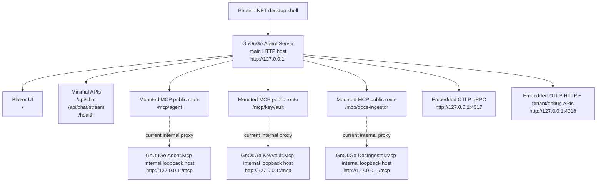

# GnOuGo.Agent (Blazor + Minimal API)

This solution contains:
- **GnOuGo.Agent.Server**: Blazor (server interactive) UI + Minimal API streaming endpoint; published as a trimmed self-contained single-file executable with bundled MCP tools.
- **GnOuGo.Agent.Shared**: shared DTOs

## Architecture

This component is independently testable per `AGENTS.md` rules. It references `GnOuGo.Agent.Mcp`, `GnOuGo.KeyVault.Mcp`, `GnOuGo.DocIngestor.Mcp`, and `GnOuGo.OtlpCollector.Server` as project dependencies, mounting their services in-process to minimise coupling while exposing everything through a single host.

### Runtime topology



#### Public vs internal ports

- The **public application port** is the main `GnOuGo.Agent.Server` listener, for example `http://127.0.0.1:58443`.
- The mounted MCP routes that the UI and runtime services should use are:
  - `http://127.0.0.1:58443/mcp/agent`
  - `http://127.0.0.1:58443/mcp/keyvault`
  - `http://127.0.0.1:58443/mcp/docs-ingestor`
- Ports such as `60183`, `60683`, `61914`, or `61915` are **ephemeral internal loopback ports** currently used by the mounted MCP implementation.
- Those ephemeral ports are **used** today, but only as a private implementation detail behind the main server proxy. They are not intended as user-facing endpoints.

> Design note: the current implementation already exposes all HTTP MCP traffic through the main server URL. The extra loopback ports exist only because the mounted MCP routes proxy to internal sub-hosts.

## Mounted MCP endpoints

`GnOuGo.Agent.Server` hosts the local MCP HTTP services in-process and mounts them on dedicated routes:

- `GnOuGo.Agent.Mcp` → `/mcp/agent`
- `GnOuGo.KeyVault.Mcp` → `/mcp/keyvault`
- `GnOuGo.DocIngestor.Mcp` → `/mcp/docs-ingestor`

The default placeholders in `appsettings.json` intentionally use port `0`:
    
```json
{
  "LLM": {
	"McpServers": {
	  "GnOuGo.Agent.Mcp": {
		"Type": "http",
		"Url": "http://127.0.0.1:0/mcp/agent"
	  },
	  "GnOuGo.KeyVault.Mcp": {
		"Type": "http",
		"Url": "http://127.0.0.1:0/mcp/keyvault"
	  },
	  "GnOuGo.DocIngestor.Mcp": {
		"Type": "http",
		"Url": "http://127.0.0.1:0/mcp/docs-ingestor"
	  }
	}
  }
}
```

At startup, the server replaces port `0` with the actual bound local address and republishes those URLs through the runtime MCP configuration store.

In other words, runtime consumers should treat the mounted MCP endpoints as part of the **same public server** as the Blazor UI and Minimal APIs, even though the current implementation uses private loopback helper listeners internally.

`GnOuGo.Agent.Server` also uses the mounted `GnOuGo.Agent.Mcp` endpoint as the persistence API for local user defaults:

- `user_config_get` — hydrate persisted `default_llm_provider`, `default_llm_model`, and `default_agent`
- `user_config_set` — save updated defaults after `/llm default`, `/llm add` auto-promotion, or `/gnougo select`

The persisted values live in the Agent MCP SQLite database (`Agent:DatabasePath`) rather than only in browser state.
LLM provider and MCP server definitions are hydrated from encrypted KeyVault secrets at startup; `user-settings.json` is no longer used.
`/llm add` can configure `openai`, `ollama`, `copilot`, and `anthropic` providers. The Anthropic provider uses the Anthropic Messages API endpoint `https://api.anthropic.com/v1` and stores the API key encrypted in KeyVault like the other remote providers. The legacy `claude` name is still accepted as an alias for existing configurations.

Bundled MCP servers can also expose selected editable fields through the `BundledMcp` settings section. Each field maps to a KeyVault secret and a runtime target such as `env:Git__Token`, so `/mcp list` can show the bundled server and `/mcp edit <name>` only prompts for the configured fields. The default configuration makes `GnOuGo.Git.Mcp` listable and exposes only the Git token; the token is saved encrypted in KeyVault and injected into the Git MCP process as `Git:Token` when runtime MCP options are hydrated.

## Dynamic workflow input composer

The Blazor chat composer resolves the active/default agent workflow through `SmartFlowService` and adapts the user input area to the workflow `inputs` declaration:

- prompt-like workflows keep the compact single textarea when there is one required `task`/`prompt`/`query`/`request`/`input`/`message` string input, with optional defaulted inputs hidden;
- workflows with multiple required inputs render one field per top-level input;
- object inputs with declared `properties` render nested fields;
- `array`, `object`, `dictionary`, and `any` fields accept JSON or YAML text;
- the UI sends structured `JsonObject` workflow inputs to `SmartFlowService` while keeping a masked Markdown summary in the chat history for sensitive-looking field names such as `key`, `secret`, `password`, or `token`.

## Main routing workflow and conversation history

When no explicit/default agent is selected, `SmartFlowService` runs the embedded `SmartFlow/main-routing-agent.yaml` workflow. That workflow uses `workflow.route` to expand all persisted database agents (`ref: { kind: database }`), select one or more relevant sub-workflows, auto-extract missing structured inputs from the prompt/history, run them in parallel, and synthesize the final response. It also includes a local general fallback workflow so a fresh installation can still answer prompts before any persisted agents exist.

The Blazor chat session now carries a server-facing `ConversationId`. The UI keeps its local transcript for display, while `SmartFlowService` loads recent server-side messages into the routing workflow as `history` and appends the user/assistant turn after a successful answer. HTTP clients can also pass `conversationId` and `prompt` on `/api/chat` or `/api/chat/stream`; if omitted, the server creates a new conversation id and returns/emits it.

Standalone MCP hosts still expose `/mcp` directly in their own projects:

- `GnOuGo.Agent.Mcp` → `http://127.0.0.1:5198/mcp`
- `GnOuGo.KeyVault.Mcp` → `http://127.0.0.1:5197/mcp`
- `GnOuGo.DocIngestor.Mcp` → `http://127.0.0.1:<port>/mcp`

## Bundled stdio MCP tools

The base `appsettings.json` now enables `GnOuGo.Browser.Mcp`, `GnOuGo.Cmd.Mcp`, `GnOuGo.Document.Mcp`, `GnOuGo.GithubCopilot.Mcp`, and `GnOuGo.Git.Mcp` for non-development runs using bundled executable paths:

```json
{
  "LLM": {
	"McpServers": {
	  "GnOuGo.Browser.Mcp": {
		"Type": "stdio",
		"Command": "tools/GnOuGo.Browser.Mcp/GnOuGo.Browser.Mcp",
		"Args": []
	  },
	  "GnOuGo.Cmd.Mcp": {
		"Type": "stdio",
		"Command": "tools/GnOuGo.Cmd.Mcp/GnOuGo.Cmd.Mcp",
		"Args": []
	  },
	  "GnOuGo.Document.Mcp": {
		"Type": "stdio",
		"Command": "tools/GnOuGo.Document.Mcp/GnOuGo.Document.Mcp",
		"Args": []
	  },
	  "GnOuGo.GithubCopilot.Mcp": {
		"Type": "stdio",
		"Command": "tools/GnOuGo.GithubCopilot.Mcp/GnOuGo.GithubCopilot.Mcp",
		"Args": []
	  },
	  "GnOuGo.Git.Mcp": {
		"Type": "stdio",
		"Command": "tools/GnOuGo.Git.Mcp/GnOuGo.Git.Mcp",
		"Args": []
	  }
	}
  }
}
```

During local source-based development, `appsettings.Development.json` still overrides these entries to use `dotnet run --project ...`.

Published outputs now bundle the MCP stdio tools under `tools/`:

- `GnOuGo.Agent.Server` publish output includes `tools/GnOuGo.Browser.Mcp/`, `tools/GnOuGo.Cmd.Mcp/`, `tools/GnOuGo.Document.Mcp/`, `tools/GnOuGo.GithubCopilot.Mcp/`, and `tools/GnOuGo.Git.Mcp/`
- `GnOuGo.Agent.Desktop` publish output includes `tools/GnOuGo.Browser.Mcp/`, `tools/GnOuGo.Cmd.Mcp/`, `tools/GnOuGo.Document.Mcp/`, `tools/GnOuGo.GithubCopilot.Mcp/`, and `tools/GnOuGo.Git.Mcp/`

This keeps the browser, command, document, code, and Git MCP servers available in packaged server, desktop, and container runs without requiring the repository source tree.
Final publish outputs also strip all `.pdb` files from both the main application and bundled MCP tools before packaging.

## Server publish (trimmed self-contained)

The linux-x64 CI and Docker paths publish `GnOuGo.Agent.Server` as a trimmed self-contained single-file executable. That path intentionally passes:

- `/p:PublishAot=false`
- `/p:PublishTrimmed=true`
- `/p:PublishSingleFile=true`

The server uses Entity Framework Core for all persistence (Agent, KeyVault, OTLP Collector, Diff, Files). Blazor Interactive Server components are fully included.

The Docker image is built from `mcr.microsoft.com/dotnet/aspnet:10.0` and starts the executable directly:

```powershell
Set-Location "C:\github\GnouGo"
docker build -t gnougo-agent -f src/GnOuGo.Agent.Server/Dockerfile .
docker run --rm -p 5000:5000 gnougo-agent
```

## Desktop publish

The desktop workflow publishes a trimmed self-contained `GnOuGo.Agent.Desktop` (Photino) with bundled stdio MCP tools. The bundled stdio tools (`GnOuGo.Cmd.Mcp`, `GnOuGo.Document.Mcp`, `GnOuGo.Git.Mcp`, `GnOuGo.GithubCopilot.Mcp`, `GnOuGo.DocIngestor.Mcp`) are published as Native AOT executables for maximum startup performance.

## Default Local Data Locations

By default, the GnOuGo workspace remains `Desktop/GnOuGo`.
Persisted agent workflow YAML files are saved in `Desktop/GnOuGo/.GnOuGo/`, uploaded files are saved in `Desktop/GnOuGo/.GnOuGo/Files/`, and SQLite databases are saved in `Desktop/GnOuGo/.GnOuGo/data/`.
The default settings carry these relative paths explicitly:

- agent workflows → `./.GnOuGo/{agent-name}.yaml`
- uploaded files → `./.GnOuGo/Files/`
- `Agent:DatabasePath` → `./.GnOuGo/data/gnougo-agent.db`
- `KeyVault:DatabasePath` → `./.GnOuGo/data/gnougo-keyvault.db`
- `DocsIngestorMcp:DatabasePath` → `./.GnOuGo/data/gnougo-docs-ingestor-mcp.db`
- `DocsIngestorMcp:VectorDatabasePath` → `./.GnOuGo/data/gnougo-docs-ingestor-vectors.sqlite`
- `DocsIngestorMcp:OriginalsDirectory` → `./.GnOuGo/data/docs-ingestor/originals/`
- `Database:Path` (embedded OTLP collector) → `./.GnOuGo/data/gnougo-telemetry.db`

If you explicitly configure an absolute path, that override is preserved.

## Embedded OTLP collector

`GnOuGo.Agent.Server` now embeds `GnOuGo.OtlpCollector.Server` by design, in the same process, but on dedicated telemetry ports.

- Main UI / APIs / mounted MCP endpoints stay on the primary app URL.
- OTLP gRPC ingest listens on `http://127.0.0.1:4317` by default.
- OTLP HTTP ingest + tenant/debug APIs listen on `http://127.0.0.1:4318` by default.

This keeps the collector reusable as an independent component while allowing the local agent and the Desktop host to export logs, traces, and metrics to an in-process collector in real time.

Configuration lives in `appsettings.json`:

```json
{
  "OtlpCollector": {
	"Enabled": true,
	"Host": "127.0.0.1",
	"GrpcPort": 4317,
	"HttpPort": 4318,
	"ExposeHealthEndpoint": true
  },
  "OpenTelemetry": {
	"Enabled": true,
	"Protocol": "Grpc",
	"OtlpEndpoint": "http://127.0.0.1:4317"
  }
}
```

When the embedded collector is enabled, the OpenTelemetry exporters are automatically repointed to the local telemetry listener.

## OpenTelemetry HTTP visibility

The server already enables both inbound and outbound HTTP span capture when OpenTelemetry is enabled:

- `AddAspNetCoreInstrumentation()` captures incoming HTTP requests handled by `GnOuGo.Agent.Server`
- `AddHttpClientInstrumentation()` captures outbound HTTP calls made by the server runtime

This means the trace detail should include standard HTTP span attributes such as:

- request method
- target URL / route
- response status code
- duration
- trace/span correlation with the rest of the workflow

The embedded OTLP collector is intentionally excluded from self-tracing loops, so collector ingest traffic is filtered out. That prevents recursive telemetry noise while keeping application HTTP calls visible.

If you want to inspect HTTP traces in local runs:

- main application traffic is emitted by `GnOuGo.Agent.Server`
- OTLP gRPC ingest endpoint is `http://127.0.0.1:4317`
- OTLP HTTP + trace/log exploration APIs are available on `http://127.0.0.1:4318`

## Circular logging guard

Embedding the OTLP collector in the same process that generates telemetry creates a potential feedback loop:

1. An application log is captured by `CollectorLoggerProvider` or the OpenTelemetry SDK log exporter.
2. The log is written to the `TelemetryIngestQueue`.
3. `TelemetryBatchWriter` flushes the batch to SQLite via EF Core.
4. EF Core logs the `INSERT INTO log_records` command.
5. Without a guard, step 4's log re-enters step 1, creating infinite growth.

`EmbeddedCollectorLogCategoryFilter` breaks this cycle by suppressing the following log category prefixes from both `CollectorLoggerProvider` and `OpenTelemetryLoggerProvider`:

- `OtlpTenantCollector` — batch writer, EF store, gRPC/HTTP receivers
- `Microsoft.EntityFrameworkCore` — all EF Core database commands
- `Microsoft.AspNetCore.Hosting.Diagnostics` — ASP.NET host-level request logs
- `Microsoft.AspNetCore.Routing.EndpointMiddleware` — endpoint routing logs
- `Grpc.AspNetCore.Server` — gRPC transport logs
- `System.Net.Http.HttpClient` — outbound HTTP (OTLP exporter traffic)

Additionally, `appsettings.json` sets these categories to `Warning` level globally so they do not spam the console output either.

## Frontend (SCSS + offline JS via Vite)

The UI styles and client helpers are bundled with **Vite** into `wwwroot/ui/app.css` and `wwwroot/ui/app.js`.

### Build frontend once

```powershell
Set-Location "C:\github\GnouGo\src\GnOuGo.Agent.Server\ClientApp"
corepack pnpm install --frozen-lockfile
corepack pnpm build
```

### Dev (optional)

```powershell
Set-Location "C:\github\GnouGo\src\GnOuGo.Agent.Server\ClientApp"
corepack pnpm install --frozen-lockfile
corepack pnpm dev
```

## Run the server

```powershell
Set-Location "C:\github\GnouGo\src\GnOuGo.Agent.Server"
dotnet run
```

Default development URLs from `Properties/launchSettings.json`:

- `https://localhost:5001`
- `http://localhost:5000`

Useful endpoints:

- UI: `/`
- chat API: `/api/chat`
- streamed chat API: `/api/chat/stream`
- health: `/health`
- mounted MCP: `/mcp/agent`, `/mcp/keyvault`
- OTLP gRPC collector: `http://127.0.0.1:4317`
- OTLP HTTP collector + trace/log exploration API: `http://127.0.0.1:4318`

> Note: for simplicity, this repo ships with pre-built assets in `wwwroot/assets`.

## Model catalog cache

The server uses `IMemoryCache` to cache provider model listings for a short duration.

- Service: `ILLMModelCatalog`
- Default absolute expiration: `30` seconds
- Configuration section: `ModelCatalogCache`

Example:

```json
{
  "ModelCatalogCache": {
	"Enabled": true,
	"AbsoluteExpirationSeconds": 30
  }
}
```

The cache key includes the active provider configuration fingerprint, so changing a provider URL or credentials invalidates the cached entry automatically.

## Test

```powershell
dotnet test "C:\github\GnouGo\tests\GnOuGo.Agent.Server.Tests\GnOuGo.Agent.Server.Tests.csproj"
```
