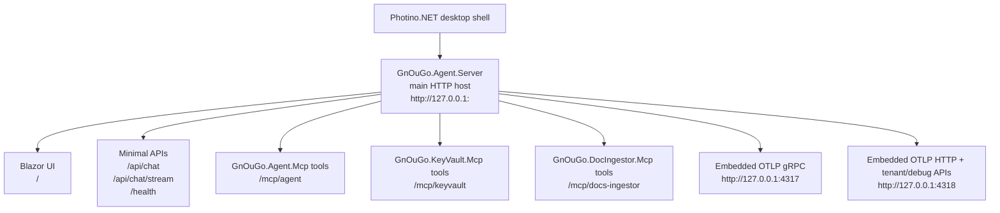

# GnOuGo.Agent (Blazor + Minimal API)

Workflow planning uses `PlanningSession → WorkflowIntentPlan → PlanningGraph → Diagnostics → Approval`; see [the planning architecture](../../docs/workflow-planning-v2.md). The planning page offers **Retry with retained usage** after an uncertain model dispatch. This explicit action preserves the failed call, conservatively accounts for missing usage, and reserves a new call within existing session limits. A stored completion is reused instead. Restart never silently redispatches an uncertain request. Workflow approval and runtime publication confirmation remain separate.

For pull-request reviews, the host exposes `GnOuGo.Review` / `review_evaluate` and `review_publish`. Original execution observations establish individual check outcomes; the host confirms the stored review, reads the current head afterward, and records the single publication attempt durably. Raw review writes cannot bypass this operation on the configured GitHub integration. See [review publication](Reviews/README.md) for configuration, contracts and restart behavior.

This solution contains:
- **GnOuGo.Agent.Server**: Blazor (server interactive) UI + Minimal API streaming endpoint; published as a trimmed self-contained single-file executable with bundled MCP tools.
- **GnOuGo.Agent.Shared**: shared DTOs

## Architecture

### Typed workflow designer

Open `/planning` to create or revise a workflow. `/gnougo add`, reprompt and failure improvement open this durable designer. It displays progress, intent, graph, unresolved fields, findings, usage, scenarios and final review. Approving and saving requires the current revision and artifact hash. Runtime write confirmation remains a separate gate.

The planning list includes **Designer** sessions and **Chat** sessions created by `workflow.plan`, including failed and stopped attempts. Select **Traces** in the list or session header to open the shared trace and log panel. Each recorded execution keeps its own trace identifier; use the timestamped selector when a session has several traces. The panel refreshes while open and stops refreshing when closed or when navigating to another session.

Chat sessions open at `/planning/{sessionId}?source=workflow` as read-only diagnostics. Continue approvals, retries and execution in the originating chat workflow. Designer links retain `/planning/{sessionId}`. Opening either view never resumes planning or dispatches a model request. Sessions are read from their original encrypted, tenant-scoped stores; nothing is copied between stores or migrated.

Trace lookup requires an exact planning-session attribute and the current tenant. It combines local capture with the embedded collector's retained records, so persisted traces remain inspectable after restart. Missing or expired telemetry is shown explicitly; lookup is bounded to 500 collector candidates and reports when that limit is reached. Trace availability is independent of model receipt retention. Trace usage totals cover recorded attributes only and are not a complete billing ledger; absent telemetry does not establish zero provider usage or cost. Designer planning activities are captured locally even when OTLP export is disabled.

`TypedWorkflowPlanning` configures `MaxRepairAttempts` (2), `MaxModelCalls` (8), `Reasoning` (`medium`), request token ceilings (12,000 input / 8,192 output), cumulative token/active-time limits and `DatabasePath`. Two host sessions may progress concurrently; workflow runtime parallelism remains independent.

Schema-7 session payloads, model reservations/receipts and budgets use encrypted KeyVault records and tenant-scoped EF Core/SQLite indexes. The fresh default is `.GnOuGo/data/gnougo-planning-v7.db`; existing databases are untouched. Restart preserves resolved graphs and cumulative budgets. Completed calls replay without another charge; uncertain dispatches stop. Saving reconciles an already committed identical artifact.

See [the planning architecture](../../docs/workflow-planning-v2.md) for public contracts, policy boundaries, diagnostics and validation commands.

### Component boundaries

This component is independently testable per `AGENTS.md` rules. It references `GnOuGo.Agent.Mcp`, `GnOuGo.KeyVault.Mcp`, `GnOuGo.DocIngestor.Mcp`, and `GnOuGo.OtlpCollector.Server` as project dependencies, mounting their services in-process to minimise coupling while exposing everything through a single host.

### Runtime topology


```mermaid
flowchart TD
	Desktop[Photino.NET desktop shell] --> Main[GnOuGo.Agent.Server\nmain HTTP host\nhttp://127.0.0.1:<app-port>]

	Main --> UI[Blazor UI\n/]
	Main --> Api[Minimal APIs\n/api/chat\n/api/chat/stream\n/health]
	Main --> AgentMcp[GnOuGo.Agent.Mcp tools\n/mcp/agent]
	Main --> KeyVaultMcp[GnOuGo.KeyVault.Mcp tools\n/mcp/keyvault]
	Main --> DocsIngestorMcp[GnOuGo.DocIngestor.Mcp tools\n/mcp/docs-ingestor]

	Main --> OtlpGrpc[Embedded OTLP gRPC\nhttp://127.0.0.1:4317]
	Main --> OtlpHttp[Embedded OTLP HTTP + tenant/debug APIs\nhttp://127.0.0.1:4318]
```

#### Single application listener

- The **public application port** is the main `GnOuGo.Agent.Server` listener, for example `http://127.0.0.1:58443`.
- The mounted MCP routes that the UI and runtime services should use are:
  - `http://127.0.0.1:58443/mcp/agent`
  - `http://127.0.0.1:58443/mcp/keyvault`
  - `http://127.0.0.1:58443/mcp/docs-ingestor`
- All three routes are mapped directly by the main ASP.NET Core host. No private MCP loopback listeners, reverse proxy, or helper-host lifecycle is created.
- The embedded OTLP listeners on ports `4317` and `4318` are unchanged.

## Mounted MCP endpoints

`GnOuGo.Agent.Server` hosts the local MCP HTTP services in-process and mounts them on dedicated routes:

- `GnOuGo.Agent.Mcp` → `/mcp/agent`
- `GnOuGo.KeyVault.Mcp` → `/mcp/keyvault`
- `GnOuGo.DocIngestor.Mcp` → `/mcp/docs-ingestor`

All three mounted services use the stable C# MCP SDK `2.2.0` and one stateless Streamable HTTP transport. Each route carries its logical server identity as endpoint metadata. The SDK's request-local `ConfigureSessionOptions` hook sets the exact server name/version and replaces the request's tool collection with only tools marked for that route; missing or unknown metadata fails closed. Because the options are request-local, concurrent discovery cannot leak one route's catalog into another.

The default placeholders in `appsettings.json` intentionally use port `0`:

```json
{
  "LLM": {
	"McpServers": {
	  "GnOuGo.Agent.Mcp": {
		"Type": "http",
		"Url": "http://127.0.0.1:0/mcp/agent"
	  },
	  "GnOuGo.KeyVault.Mcp": {
		"Type": "http",
		"Url": "http://127.0.0.1:0/mcp/keyvault"
	  },
	  "GnOuGo.DocIngestor.Mcp": {
		"Type": "http",
		"Url": "http://127.0.0.1:0/mcp/docs-ingestor"
	  }
	}
  }
}
```

After startup, the server replaces port `0` with the actual bound local address and republishes those URLs through the runtime MCP configuration store before running the existing Agent user-configuration bootstrap. Runtime consumers therefore use the same listener as the Blazor UI and Minimal APIs.

`GnOuGo.Agent.Server` also uses the mounted `GnOuGo.Agent.Mcp` endpoint as the persistence API for local user defaults:

- `user_config_get` — hydrate persisted `default_llm_provider`, `default_llm_model`, and `default_agent`
- `user_config_set` — save updated defaults after `/llm default`, `/llm add` auto-promotion, or `/gnougo select`

The persisted values live in the Agent MCP SQLite database (`Agent:DatabasePath`) rather than only in browser state.
LLM provider and MCP server definitions are hydrated from encrypted KeyVault secrets; `user-settings.json` is no longer used. Each workflow execution builds its MCP runtime catalog from the latest KeyVault-backed definitions, so a server saved through `/mcp add` is available to the next `/gnougo add` or workflow run without restarting Agent.Server. `/mcp list` and workflow capability preflight therefore use the same persisted configuration source.

Configuration logical names are case-insensitive across LLM providers, MCP servers, embedding configurations, and embedding defaults. Save operations reuse an existing canonical key and retire every equivalent case or legacy alias only after the replacement value is stored; remove operations retire all aliases for the logical configuration. A single canonical key takes precedence over a single legacy key. Multiple same-priority canonical or legacy keys for the same logical name are rejected as ambiguous without logging their values. This keeps direct KeyVault readers and Agent runtime hydration on the same deterministic configuration identity.

For user-configured HTTP servers, `/mcp edit <name>` can keep the current authentication settings, rotate an API key, replace OIDC client credentials, switch between `api_key`, `oidc`, and `none`, or remove authentication. Choosing `keep_current` preserves the encrypted credentials; choosing a named authentication mode collects replacement credentials and clears fields belonging to the previous mode. Bundled MCP servers continue to expose only their allow-listed override fields, and stdio MCP servers do not use this HTTP authentication flow.

`/llm add` can configure `openai`, `ollama`, `copilot`, and `anthropic` providers. The Anthropic provider uses the Anthropic Messages API endpoint `https://api.anthropic.com/v1` and stores the API key encrypted in KeyVault like the other remote providers. The legacy `claude` name is still accepted as an alias for existing configurations.

The built-in `local` provider runs Qwen3 directly inside Agent.Server through
LLamaSharp; it needs no API key, HTTP model server, Python, Docker, or child
process. The model is deliberately not bundled in release archives. Manage the
pinned and checksum-verified catalog with:

```text
/models list
/models install qwen3:0.6b
/models remove qwen3:0.6b
/models remove qwen3:0.6b --force
```

An install preserves an existing usable default. If the current default is absent
or incompletely authenticated (including the untouched empty OpenAI placeholder),
Agent persists `local / qwen3:0.6b` through its tenant-aware Agent MCP configuration
boundary. Removing the active default requires `--force`. `/llm list` includes the
built-in model and `/llm default local qwen3:0.6b` selects an installed model.

The immutable catalog entry is Apache-2.0
`Qwen3-0.6B-Q4_0.gguf`, revision
`a41486f827d17edd055fe6b3b0ba3f8d427c0519`, size `428,970,080`, and
SHA-256 `da2572f16c06133561ce56accaa822216f2391ef4d37fba427801cd6736417d4`.
Downloads are resumable and complete atomically only after exact size and checksum
verification.

After model selection, `/llm add` and `/llm edit <provider>` always display an editable review form containing token limits, pricing, structured-output/tool/JSON support, temperature and reasoning behavior, vision/audio/embedding support, supported reasoning efforts, and unsupported request parameters. Exact catalog values remain catalog-backed when accepted unchanged. Edited values and accepted fuzzy/heuristic defaults are persisted as non-secret, provider-qualified overrides such as `openai/model-id`; legacy unqualified overrides remain readable. Approximate matches are restricted to the normalized provider and the UI identifies the source model and similarity before saving.

Bundled MCP servers can also expose selected editable fields through the `BundledMcp` settings section. Each field maps to a KeyVault secret and a runtime target such as `env:Git__Token`, so `/mcp list` can show the bundled server and `/mcp edit <name>` only prompts for the configured fields. The default configuration makes `GnOuGo.Git.Mcp` listable and exposes only the Git token; the token is saved encrypted in KeyVault and injected into the Git MCP process as `Git:Token` when runtime MCP options are hydrated.

`GnOuGo.GithubCopilot.Mcp` is also a listable bundled server. `/mcp edit GnOuGo.GithubCopilot.Mcp` exposes its provider override, fallback model, reasoning effort, logged-in-user mode, request timeout, managed-session TTL, broad-approval gate, and reusable sandbox-bypass gate. Provider choices come from configured KeyVault LLM providers. Values are validated and stored as separate encrypted `LLM--McpServerOverrides--GnOuGo.GithubCopilot.Mcp--...` entries, while per-field inheritance deletes the selected override. Enabling reusable sandbox bypass automatically enables broad approvals through generic editable-field dependency metadata. The bundled definition is marked with `ReadsKeyVaultDirectly`, so runtime hydration propagates only `KeyVault__DatabasePath`, including a custom path, and never injects decrypted `Code__Copilot__...` values. The MCP retrieves and maps its own configuration through the generic `GnOuGo.KeyVault.Core` abstractions. Credentials stay in their existing `LLM--Models--<provider>` entries, and changes affect the next workflow/MCP process rather than an already-running session.

## Dynamic workflow input composer

The Blazor chat composer resolves the active/default agent workflow through `SmartFlowService` and adapts the user input area to the workflow `inputs` declaration:

- prompt-like workflows keep the compact single textarea when there is one required `task`/`prompt`/`query`/`request`/`input`/`message` string input, with optional defaulted inputs hidden;
- workflows with multiple required inputs render one field per top-level input;
- object inputs with declared `properties` render nested fields;
- `array`, `object`, `dictionary`, and `any` fields accept JSON or YAML text;
- the UI sends structured `JsonObject` workflow inputs to `SmartFlowService` while keeping a masked Markdown summary in the chat history for sensitive-looking field names such as `key`, `secret`, `password`, or `token`.

## Live workflow animation in chat

Every submitted chat request renders a correlation-owned
`GnOuGo.Assets.Animation` scene inside its assistant response, including
workflow/agent creation and slash commands. The **Traces**, **Animation**, and
**Activity** controls remain available even when a response has no text or
ends in an error. The scene follows real workflow telemetry: stable workflow
instances and step occurrences drive walking, roundabout work, parallel clones,
runtime workflow handoffs, parcel completion, failure, and final delivery. It
never runs a second timer-driven preview. Agent creation/management commands
reuse their native workflow telemetry and preserve child-workflow identities.
Direct slash commands without a workflow use a small synthetic command
lifecycle so their waiting, success, and failure states have the same visual
contract as workflow-backed messages.

The conversation uses a document-style layout: compact right-aligned user
prompts and borderless full-width assistant turns. Each response keeps its own
full-width animation panel, with a viewport-responsive height capped at 620 px
and native horizontal and vertical scrollbars. Follow mode is enabled by
default and scrolls only that message's panel. During a walk, the camera leads
only partway toward the next station so GnOuGo remains visibly in motion; the
step event then completes the centering. Switching conversations disposes
detached browser controllers; returning to an in-memory conversation remounts
the SVG and replays its ordered scene patches/events so actors, portals, scene
layers, and queued events cannot leak between turns.

Human Input cards use the same centered 1160 px conversation column, with an
860 px maximum card width. While the workflow waits, its GnOuGo retains the
persistent waiting pose. When the user submits a response, a blue response
capsule enters from beyond the visible animation viewport, arcs toward the
waiting actor, and disappears on receipt before execution resumes.
Resume preserves the already-active scene and the human-step completion uses a
stationary actor rig, avoiding a duplicate scene entrance, reception pose, or
top-to-bottom actor jump.

The empty assistant turn displays three small, borderless black typing dots
from submission through Human Input pauses and other workflow activity.
Response-level messages from nested LLM steps appear above the loader as
preliminary responses and also remain available in Activity. Submitted Human
Input values are listed beside them, with sensitive values masked. These
progress items remain visible with the final response, while only the principal
workflow answer replaces the loader itself. An execution error also dismisses
the loader. The dots are left-aligned with assistant response text.

User turns are rendered as encoded plain text rather than reparsed as Markdown.
This preserves every submitted line break, indentation, and large pasted block
without allowing Markdown extensions such as YAML front matter to hide content.
Assistant turns continue to use the full Markdown pipeline.

The left navigation uses the base `GnOuGo.Assets.Bears` SVG as an inline,
script-free idle animation. Its stable ID prefix prevents SVG definition
collisions with workflow actors. Conversations are ordered newest-first and
grouped using English local-date labels such as **Today**, **Yesterday**,
**The day before yesterday**, and **N days ago**. The compact brand is
**GnOuGo** with the tagline **Simple. Safe. Transparent.**

The top navigation uses a blue **G** wordmark and a **GnOuGo** product trigger.
Its custom dropdown lists the default dynamic workflow and every available
agent while preserving the persisted default-agent selection. A separate
ellipsis menu provides conversation creation and agent-list refresh actions.
Both menus close through a shared click-away backdrop and remain compact on
mobile.

Dynamic planning and routing have dedicated live semantics. `workflow.plan`
walks the main GnOuGo to a planning roundabout and keeps the `think` action for
the complete running step, `workflow.route` uses a routing
roundabout, and `workflow.execute` uses a handoff roundabout. When a generated or
selected workflow starts, a caller-aware `workflow.discovered` event announces
the new lane before its GnOuGo spawns and receives the parcel. Short generated
workflows still receive compact leaf roundabouts; source-less runtime work can
append bounded step patches instead of leaving the actor on an anonymous node.

The browser keeps a short presentation queue so very fast real events still
produce visible walking, working, handoff, and delivery motion without delaying
the workflow. A long-running real step repeats a calm action cycle until its
authoritative `step.end` arrives: routing communicates, LLM work types, MCP
work uses its communication pose, and HITL keeps waiting. Controller mounting
is acknowledged before events leave the Blazor queue. Every patch and event
also verifies that the controller still owns the currently connected Blazor
host. If streaming replaced that DOM branch, the stale controller is rejected
and the current panel is remounted from its authoritative event history instead
of silently animating a detached SVG. The card and message bubbles use the full
chat width; the SVG keeps its complete aspect ratio, has no maximum scene
height, and is resized by a `ResizeObserver` when the application window
changes. When a later question
creates another animation card, the chat follows it only after its SVG has
mounted and acquired its final height. Focus events may pan inside their own
card but cannot scroll the conversation back to an older execution.

Thinking and technical progress are kept out of `ChatMessageDto` and local chat
history. They are held in memory for the active execution and displayed from
the card's **Activity** drawer. The existing trace drawer remains separate.
Animation state is also transient and is not restored after a reload.

`human.input` pauses the scene at a human-input counter and keeps the GnOuGo
alive with calm waiting motion. Text, choice, confirmation, and structured
controls appear attached to the live card; submitted values are summarized in
that card instead of becoming chat messages. Timeout, cancellation, and
failure update the same parcel and execution status. Confirmation buttons use
their labels only for presentation and submit a Boolean response; Flow.Core also
normalizes provider labels such as `approve` and `reject` before expressions run.
MCP elicitation uses this same visible card and wire payload. In particular,
interactive Copilot permission requests emit the waiting animation before the
form is streamed, and emit a resumed/refused/cancelled signal afterward. The
request is correlated to its exact workflow run and MCP step rather than read
from a shared pending-request queue, so concurrent executions cannot steal one
another's permission form.

When the Copilot host gate `Code__Copilot__EnableApproveAll=true` is enabled,
permission cards distinguish **Allow similar operations for this task**,
**Allow all for this Copilot task**, **Allow all for this workflow run**, and
**Allow all future runs for this agent**. Persistent approval requires a second
confirmation. It is keyed by tenant and stable agent ID, survives restarts and
renames, and is revoked automatically when the agent is deleted. Use
`/mcp copilot permissions` to list persistent grants and
`/mcp copilot permissions revoke <grant-id>` to revoke one manually. When
`Code__Copilot__EnableSandboxBypassGrants=true` is also enabled, a sandbox-bypass
request offers separate task, workflow, and future-agent broad choices. The
future-agent choice requires a second warning confirmation. Ordinary broad grants
still exclude bypass. Automatically approved operations remain visible in
**LIVE WORKFLOW ACTIVITY** and never leave a stale human-input card.

`/api/chat/stream` retains its existing SSE event names and text payloads.
Additional `animation.prepared`, `animation.scene.patch`, and
`animation.event` events use single-line, source-generated JSON payloads.
Workflow YAML and inputs are not included in those animation payloads.

Blazor serializes animation interop through a single guarded queue so
overlapping post-render callbacks cannot remove or reorder live events across
message-owned panels. Mutable conversation and execution collections are
snapshotted before any JavaScript interop await, preventing streaming updates
from invalidating an active renderer enumeration and terminating the Blazor
circuit. Error statuses are normalized and a terminal failed event
is added when a response-level failure has no matching workflow terminal event.
On a real workflow failure, the actor stays at the highlighted crashing step
in a single terminal failure pose; no successful return-to-delivery
choreography is queued, so the panel does not blink between failure and walking.
The browser controller records its applied-event count, latest event, pending
queue size, and recoverable error on the scene host for runtime diagnostics.
One malformed visual event is logged and skipped without stopping later
workflow motion.

Flow can reject invalid or missing inputs before its first telemetry span is
opened. In that case Agent.Server emits a short failed startup and delivery
sequence instead of leaving the prepared scene indefinitely at its first
frame. Once workflow telemetry has started, only real workflow and step
signals drive the scene.

The Agent Vite bundle is incrementally rebuilt by normal `dotnet build` and
`dotnet run` builds when Agent, Animation, or Bears frontend runtime sources
change. Set `-p:SkipClientBuild=true` only when a previously built bundle is
known to be current.

## Main routing workflow and conversation history

Workflow creation and improvement use the durable intent-to-graph planner described above. Revision imports the existing workflow as baseline context and carries failure diagnostics separately. Every revised artifact undergoes complete validation and fresh approval. Model, MCP and human integrations remain host-owned.

The Blazor chat session now carries a server-facing `ConversationId`. The UI keeps its local transcript for display, while `SmartFlowService` loads recent server-side messages into the routing workflow as `history` and appends the user/assistant turn after a successful answer. HTTP clients can also pass `conversationId` and `prompt` on `/api/chat` or `/api/chat/stream`; if omitted, the server creates a new conversation id and returns/emits it.

Standalone MCP hosts still expose `/mcp` directly in their own projects:

- `GnOuGo.Agent.Mcp` → `http://127.0.0.1:5198/mcp`
- `GnOuGo.KeyVault.Mcp` → `http://127.0.0.1:5197/mcp`
- `GnOuGo.DocIngestor.Mcp` → `http://127.0.0.1:<port>/mcp`

## Bundled stdio MCP tools

The base `appsettings.json` now enables `GnOuGo.Browser.Mcp`, `GnOuGo.Cmd.Mcp`, `GnOuGo.Document.Mcp`, `GnOuGo.GithubCopilot.Mcp`, and `GnOuGo.Git.Mcp` for non-development runs using bundled executable paths:

```json
{
  "LLM": {
	"McpServers": {
	  "GnOuGo.Browser.Mcp": {
		"Type": "stdio",
		"Command": "tools/GnOuGo.Browser.Mcp/GnOuGo.Browser.Mcp",
		"Args": []
	  },
	  "GnOuGo.Cmd.Mcp": {
		"Type": "stdio",
		"Command": "tools/GnOuGo.Cmd.Mcp/GnOuGo.Cmd.Mcp",
		"Args": []
	  },
	  "GnOuGo.Document.Mcp": {
		"Type": "stdio",
		"Command": "tools/GnOuGo.Document.Mcp/GnOuGo.Document.Mcp",
		"Args": []
	  },
	  "GnOuGo.GithubCopilot.Mcp": {
		"Type": "stdio",
		"Command": "tools/GnOuGo.GithubCopilot.Mcp/GnOuGo.GithubCopilot.Mcp",
		"Args": []
	  },
	  "GnOuGo.Git.Mcp": {
		"Type": "stdio",
		"Command": "tools/GnOuGo.Git.Mcp/GnOuGo.Git.Mcp",
		"Args": []
	  }
	}
  }
}
```

Normal `GnOuGo.Agent.Server` and `GnOuGo.Agent.Desktop` builds stage framework-dependent apphosts for these servers under their own `bin/<Configuration>/net10.0/tools/` directories. `appsettings.Development.json` only extends discovery and call timeouts and continues to use these clean direct commands; it never places `dotnet run` on the MCP stdout transport.

Published outputs now bundle the MCP stdio tools under `tools/`:

- `GnOuGo.Agent.Server` publish output includes `tools/GnOuGo.Browser.Mcp/`, `tools/GnOuGo.Cmd.Mcp/`, `tools/GnOuGo.Document.Mcp/`, `tools/GnOuGo.GithubCopilot.Mcp/`, and `tools/GnOuGo.Git.Mcp/`
- `GnOuGo.Agent.Desktop` publish output includes `tools/GnOuGo.Browser.Mcp/`, `tools/GnOuGo.Cmd.Mcp/`, `tools/GnOuGo.Document.Mcp/`, `tools/GnOuGo.GithubCopilot.Mcp/`, and `tools/GnOuGo.Git.Mcp/`

This keeps the browser, command, document, code, and Git MCP servers available in packaged server, desktop, and container runs without requiring the repository source tree.
Final publish outputs also strip all `.pdb` files from both the main application and bundled MCP tools before packaging.

## Server publish (trimmed self-contained)

The linux-x64 CI and Docker paths publish `GnOuGo.Agent.Server` as a trimmed self-contained single-file executable. That path intentionally passes:

- `/p:PublishAot=false`
- `/p:PublishTrimmed=true`
- `/p:PublishSingleFile=true`

The publish retains the LLamaSharp linux-x64 CPU native assets beside the
single-file host; CI explicitly verifies these files.

The server uses Entity Framework Core for all persistence (Agent, KeyVault, OTLP Collector, Diff, Files). That EF Core + SQLite boundary is mandatory: publish-warning work must retain the existing contexts, repositories, schemas, tenant behavior, and compiled models where the component has one. Blazor Interactive Server components are fully included. Verified framework-only trim diagnostics are isolated to these publish profiles; compile-time trim analysis stays enabled.

Run the repository publish verification for the current platform, or audit the exact package/framework warning boundaries with their normal suppressions disabled:

```powershell
pwsh scripts/verify-warning-free-publishes.ps1 -RuntimeIdentifier win-x64
pwsh scripts/verify-warning-free-publishes.ps1 -RuntimeIdentifier win-x64 -AuditKnownTrimWarnings
```

The Docker image is built from `mcr.microsoft.com/dotnet/aspnet:10.0` and starts the executable directly:

```powershell
Set-Location "C:\github\GnouGo"
docker build -t gnougo-agent -f src/GnOuGo.Agent.Server/Dockerfile .
docker run --rm -p 5000:5000 gnougo-agent
```

## Desktop publish

The desktop workflow publishes a trimmed self-contained `GnOuGo.Agent.Desktop` (Photino) with bundled stdio MCP tools. The bundled stdio tools (`GnOuGo.Cmd.Mcp`, `GnOuGo.Document.Mcp`, `GnOuGo.Git.Mcp`, `GnOuGo.GithubCopilot.Mcp`, `GnOuGo.DocIngestor.Mcp`) are published as Native AOT executables for maximum startup performance.

All six desktop RIDs include their LLamaSharp CPU native assets: `linux-x64`,
`linux-arm64`, `win-x64`, `win-arm64`, `osx-arm64`, and `osx-x64`. macOS ARM64
automatically uses Metal layers; Windows and Linux use CPU execution. CUDA and
Vulkan acceleration remain follow-up work.

## Default Local Data Locations

By default, the GnOuGo workspace remains `Desktop/GnOuGo`.
Persisted agent workflow YAML files are saved in `Desktop/GnOuGo/.GnOuGo/`, uploaded files are saved in `Desktop/GnOuGo/.GnOuGo/Files/`, and SQLite databases are saved in `Desktop/GnOuGo/.GnOuGo/data/`.
Workflow-owned working directories are separate and visible under `Desktop/GnOuGo/workflows/`, using purpose-specific children such as `workflows/github-review-123`. Every Agent Server `workflow.plan` entrypoint instructs generated workflows to use this visible root and never `.GnOuGo/` for project or file paths. The `.GnOuGo/` subtree remains reserved for GnOuGo-managed internal state.
The default settings carry these relative paths explicitly:

- agent workflows → `./.GnOuGo/{agent-name}.yaml`
- uploaded files → `./.GnOuGo/Files/`
- `Agent:DatabasePath` → `./.GnOuGo/data/gnougo-agent.db`
- `KeyVault:DatabasePath` → `./.GnOuGo/data/gnougo-keyvault.db`
- `DocsIngestorMcp:DatabasePath` → `./.GnOuGo/data/gnougo-docs-ingestor-mcp.db`
- `DocsIngestorMcp:VectorDatabasePath` → `./.GnOuGo/data/gnougo-docs-ingestor-vectors.sqlite`
- `DocsIngestorMcp:OriginalsDirectory` → `./.GnOuGo/data/docs-ingestor/originals/`
- `Database:Path` (embedded OTLP collector) → `./.GnOuGo/data/gnougo-telemetry.db`
- local GGUF models → `./.GnOuGo/models/`

If you explicitly configure an absolute path, that override is preserved.

## Embedded OTLP collector

`GnOuGo.Agent.Server` now embeds `GnOuGo.OtlpCollector.Server` by design, in the same process, but on dedicated telemetry ports.

- Main UI / APIs / mounted MCP endpoints stay on the primary app URL.
- OTLP gRPC ingest listens on `http://127.0.0.1:4317` by default.
- OTLP HTTP ingest + tenant/debug APIs listen on `http://127.0.0.1:4318` by default.

This keeps the collector reusable as an independent component while allowing the local agent and the Desktop host to export logs, traces, and metrics to an in-process collector in real time.

Configuration lives in `appsettings.json`:

```json
{
  "OtlpCollector": {
	"Enabled": true,
	"Host": "127.0.0.1",
	"GrpcPort": 4317,
	"HttpPort": 4318,
	"ExposeHealthEndpoint": true
  },
  "OpenTelemetry": {
	"Enabled": true,
	"Protocol": "Grpc",
	"OtlpEndpoint": "http://127.0.0.1:4317"
  }
}
```

When the embedded collector is enabled, the OpenTelemetry exporters are automatically repointed to the local telemetry listener.

## Per-workflow trace files

`SmartFlowService` can save the complete OpenTelemetry activity tree associated with each execution after its root chat span has stopped. Enable the typed setting in `appsettings.json`:

```json
{
  "WorkflowTraceExport": {
    "Enabled": true
  }
}
```

Each execution produces an indented JSON document under the workspace data directory:

```text
<GnOuGo workspace>/.GnOuGo/traces/DD-MM-YY-HH-mm-ss.json
```

JSON is used instead of plain text so an LLM or another diagnostic tool can reliably inspect the trace metadata, summary, spans, parent/child relationships, semantic attributes, baggage, events, and links. If concurrent workflows finish during the same second, the later filename receives a short trace-id suffix so no trace is overwritten. Capture remains available when OTLP export is disabled; setting `WorkflowTraceExport:Enabled` to `false` disables both capture and file creation.

## OpenTelemetry HTTP visibility

The server already enables both inbound and outbound HTTP span capture when OpenTelemetry is enabled:

- `AddAspNetCoreInstrumentation()` captures incoming HTTP requests handled by `GnOuGo.Agent.Server`
- `AddHttpClientInstrumentation()` captures outbound HTTP calls made by the server runtime

This means the trace detail should include standard HTTP span attributes such as:

- request method
- target URL / route
- response status code
- duration
- trace/span correlation with the rest of the workflow

The embedded OTLP collector is intentionally excluded from self-tracing loops, so collector ingest traffic is filtered out. That prevents recursive telemetry noise while keeping application HTTP calls visible.

If you want to inspect HTTP traces in local runs:

- main application traffic is emitted by `GnOuGo.Agent.Server`
- OTLP gRPC ingest endpoint is `http://127.0.0.1:4317`
- OTLP HTTP + trace/log exploration APIs are available on `http://127.0.0.1:4318`

## Circular logging guard

Embedding the OTLP collector in the same process that generates telemetry creates a potential feedback loop:

1. An application log is captured by `CollectorLoggerProvider` or the OpenTelemetry SDK log exporter.
2. The log is written to the `TelemetryIngestQueue`.
3. `TelemetryBatchWriter` flushes the batch to SQLite via EF Core.
4. EF Core logs the `INSERT INTO log_records` command.
5. Without a guard, step 4's log re-enters step 1, creating infinite growth.

`EmbeddedCollectorLogCategoryFilter` breaks this cycle by suppressing the following log category prefixes from both `CollectorLoggerProvider` and `OpenTelemetryLoggerProvider`:

- `OtlpTenantCollector` — batch writer, EF store, gRPC/HTTP receivers
- `Microsoft.EntityFrameworkCore` — all EF Core database commands
- `Microsoft.AspNetCore.Hosting.Diagnostics` — ASP.NET host-level request logs
- `Microsoft.AspNetCore.Routing.EndpointMiddleware` — endpoint routing logs
- `Grpc.AspNetCore.Server` — gRPC transport logs
- `System.Net.Http.HttpClient` — outbound HTTP (OTLP exporter traffic)

Additionally, `appsettings.json` sets these categories to `Warning` level globally so they do not spam the console output either.

## Frontend (SCSS + offline JS via Vite)

The UI styles and client helpers are bundled with **Vite** into `wwwroot/ui/app.css` and `wwwroot/ui/app.js`.

### Build frontend once

```powershell
Set-Location "C:\github\GnouGo\src\GnOuGo.Agent.Server\ClientApp"
corepack pnpm install --frozen-lockfile
corepack pnpm build
```

### Dev (optional)

```powershell
Set-Location "C:\github\GnouGo\src\GnOuGo.Agent.Server\ClientApp"
corepack pnpm install --frozen-lockfile
corepack pnpm dev
```

## Run the server

```powershell
Set-Location "C:\github\GnouGo\src\GnOuGo.Agent.Server"
dotnet run
```

Default development URLs from `Properties/launchSettings.json`:

- `https://localhost:5001`
- `http://localhost:5000`

Useful endpoints:

- UI: `/`
- chat API: `/api/chat`
- streamed chat API: `/api/chat/stream`
- health: `/health`
- mounted MCP: `/mcp/agent`, `/mcp/keyvault`
- OTLP gRPC collector: `http://127.0.0.1:4317`
- OTLP HTTP collector + trace/log exploration API: `http://127.0.0.1:4318`

> Note: for simplicity, this repo ships with pre-built assets in `wwwroot/assets`.

## Model catalog cache

The server uses `IMemoryCache` to cache provider model listings for a short duration.

- Service: `ILLMModelCatalog`
- Default absolute expiration: `30` seconds
- Configuration section: `ModelCatalogCache`

Example:

```json
{
  "ModelCatalogCache": {
	"Enabled": true,
	"AbsoluteExpirationSeconds": 30
  }
}
```

The cache key includes the active provider configuration fingerprint, so changing a provider URL or credentials invalidates the cached entry automatically.

## MCP capability cache

Workflow execution uses `IMemoryCache` to cache MCP server capability discovery results: tools, prompts, resources, and their descriptions.

Tool schemas are still discovered once on every newly created live MCP client.
This per-session initialization is required for SDK transport annotations such
as `x-mcp-header`; the shared cache cannot replace it. Consequently request
fields such as GitHub `owner` and `repo` continue to be emitted as
`Mcp-Param-*` headers after a runtime has been rebuilt.

When an agent run offers **Improve**, the failure details carry the deepest
failing local workflow and step. The revision planner receives
that location: it may update the failed step and existing direct consumers,
but it cannot remove or rename sub-workflows, `workflow.call` edges, steps,
branches, skills, or public contracts. Any broad rewrite is rejected and
reprompted up to three times before the original workflow is left untouched.

- Service: `WorkflowEngine`
- Default sliding expiration: `3600` seconds
- Configuration section: `McpCapabilityCache`

Example:

```json
{
  "McpCapabilityCache": {
	"SlidingExpirationSeconds": 3600
  }
}
```

## Test

```powershell
dotnet test "C:\github\GnouGo\tests\GnOuGo.Agent.Server.Tests\GnOuGo.Agent.Server.Tests.csproj"
```

Discovery and validation failures appear as located diagnostics in the durable session. Revise the intent to rebuild against current capabilities. Catalog revalidation requires no model call. Cumulative usage survives retries and restart.

### Provider HTTP retries

Planning requests use background mode. For an OpenAI-compatible deployment that supports
Chat Completions but not Responses, select the protocol before starting Server or Desktop:

```text
--LLM:Models:<provider-name>:RequestPolicy:BackgroundProtocol=ChatCompletions
```

Replace `<provider-name>` with the configured provider key. This existing host setting survives
the KeyVault credential overlay; it does not change the model, planning budgets or workflow.
`Auto` selects Responses and does not probe for protocol support. An HTTP 404 on that route
can appear as “The requested LLM model is unavailable”; inspect the recorded HTTP route and
status before revising a workflow or changing models. A stopped request without a completion
receipt still has unknown usage. Changing configuration does not authorize replaying that
request identity or reset its accounting.

A provider's completion-token limit can include reasoning tokens as well as returned JSON.
An `output_limit` receipt with empty text can therefore reflect exhausted reasoning allowance,
not an oversized plan. Check the stored usage and original request ceiling. The generic
bootstrap sets `generator.max_output_tokens: 8192`; the accepted live benchmark explicitly
used 32768. An agreed change to that setting applies to a new request, preserves medium
reasoning and the call/repair budgets, and does not change earlier reservations or receipts.
The planner never raises the ceiling or retries a truncated response automatically.

Transport retries are owned by [AI.Core](../GnOuGo.AI.Core/README.md#http-resilience).
The optional `retryPolicy` object in a KeyVault provider configuration controls `maxAttempts`,
`maxUncertainRetries` and `attemptTimeoutMilliseconds`, plus bounded backoff settings.
Omitting it preserves the base policy. Providing it replaces that policy, with defaults for
unspecified fields. Malformed settings fail validation; `Retry-After` cannot be disabled.
Uncertain generation recovery requires a host accounting journal. The live planning benchmark
supplies it; ordinary planning journals retain their single-attempt safety boundary.

### Generation protocol

`/llm add` and `/llm edit openai` expose **Generation protocol** on the connection card.
New OpenAI configurations use **Background — Responses API**; choose **Chat Completions — foreground** for gateways without the Responses endpoint.
`Auto` continues to mean background Responses. There is no automatic protocol fallback.
The Save confirmation and `/llm list` show the selection. Saving preserves unrelated settings,
stores the selection encrypted in KeyVault, and applies it to new calls immediately. The existing
post-save credential check uses the selected protocol; reserved planning calls and receipts stay unchanged.

### Inspectable model calls

Enable `TraceDebug:Enabled=true` for retained content, then open
**Traces → Pipeline / LLM calls** from chat or Workflow designer. Expand a
call to inspect its retained prompt/schema, response, tool calls and repair
context, with byte sizes, labelled token estimates, reported usage and HTTP
attempts. Content loads on demand from encrypted tenant-scoped storage; missing
usage is unknown. Historical planner requests remain available as journal history
when trace links have expired. See [configuration, retention and limitations](../../docs/llm-protocol-and-traces.md).
