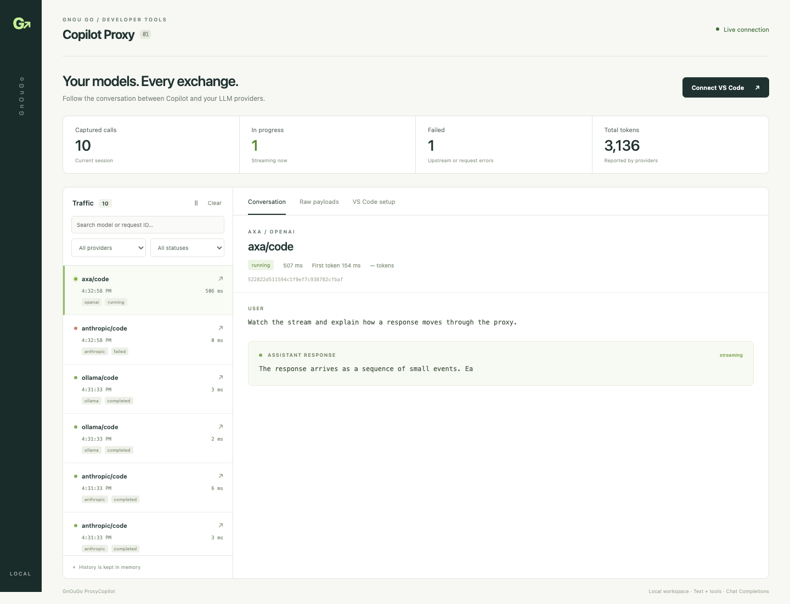

# GnOuGo.ProxyCopilot.Server

A standalone .NET 10 loopback proxy for VS Code Chat and Agent mode. Configure LLM endpoints in a typed, ignored `appsettings.Development.json`, supply credentials through environment overrides, and inspect live traffic in the React dashboard.



The server references only `GnOuGo.AI.Core`, `GnOuGo.Auth.Core`, and `GnOuGo.Observability.Core`. It needs no database or running GnOuGo services. Configuration is loaded once at startup; restart after changes. Traffic stays in memory and is discarded on exit.

## Build and run

From the repository root, using the SDK pinned by `global.json` and Node.js 22.20+:

```bash
corepack pnpm install --frozen-lockfile
corepack pnpm --filter gnougo-proxy-copilot-client build
dotnet build src/GnOuGo.ProxyCopilot.Server/GnOuGo.ProxyCopilot.Server.csproj
dotnet run --project src/GnOuGo.ProxyCopilot.Server
```

Open **http://127.0.0.1:5087/ui/**. The default configuration has no providers and shows setup instructions. Vite builds into `wwwroot/ui`; the server copies these assets to its build output and publish directory.

The launch profile selects `Development`, which loads the workstation settings file when using `dotnet run`. To run with only the public defaults, use `dotnet run --project src/GnOuGo.ProxyCopilot.Server --no-launch-profile -- --environment Production`. Direct DLL/executable launches default to Production unless `DOTNET_ENVIRONMENT` or `ASPNETCORE_ENVIRONMENT` selects another environment.

For frontend development, run the server and `corepack pnpm --filter gnougo-proxy-copilot-client dev`. The Vite development proxy forwards `/api` to the loopback server with the matching origin; the production server itself does not allow cross-origin access.

## Configure providers

Copy an example to `src/GnOuGo.ProxyCopilot.Server/appsettings.Development.json`, then merge additional `ProxyCopilot.Providers` entries there. Keep the tracked `appsettings.json` unchanged: it contains only loopback, logging, capture, and empty-provider defaults.

| Example | Authentication | Upstream API |
|---|---|---|
| [OIDC client secret](examples/oidc-client-secret.json) | OIDC discovery + `client_credentials` + `client_secret_basic` | Chat Completions |
| [OIDC private key](examples/oidc-private-key.json) | OIDC discovery + RS256 `private_key_jwt` | Chat Completions |
| [OpenAI-compatible](examples/openai.json) | Bearer API key | Chat Completions |
| [Copilot](examples/copilot.json) | `GITHUB_TOKEN`, then `COPILOT_API_KEY` | Configured Copilot/GitHub Models Chat Completions endpoint |
| [Anthropic](examples/anthropic.json) | `x-api-key` | Native Messages |
| [Ollama](examples/ollama.json) | None | Native `/api/chat` |

Replace the example URL, upstream model ID, issuer, client ID, scopes, and metadata with your actual values. Example prices are zero placeholders, not provider pricing. Multiple named providers of the same type are supported. Names and model aliases use letters, digits, `.`, `_`, or `-`; the exposed ID is the exact, case-sensitive `<provider>/<alias>`, such as `internal/code`. The actual upstream model ID is forwarded unchanged, including vendor prefixes.

`appsettings.Development*.json` and `appsettings.Local*.json` are ignored and excluded from publish output. Only the standard environment-named file is automatically loaded; the Local pattern also protects optional workstation files from Git. Endpoints, client IDs, scopes, model IDs, and other internal settings belong in these private files or environment variables. CI rejects tracked private configuration and checks that publishing excludes a synthetic development file. Run `python3 scripts/check-proxy-copilot-config.py` before committing. Never force-add local settings; review staged files before pushing.

Connection options reuse AI.Core's `ModelProviderOptions`; metadata reuses `LLMModelMetadata`. Set `Connection.Type` explicitly to `openai`, `copilot`, `anthropic`, or `ollama`. Model input/output limits are required. Set `Capabilities.SupportsTools` to `true` only for models supporting tool calls. Advertised capabilities are restricted to this proxy's text/tool support even when richer metadata is configured.

`Authentication` accepts `None`, `ApiKey`, `OidcClientSecret`, `OidcPrivateKey`, or `CopilotEnvironment`. OIDC modes also work with native providers behind enterprise gateways. Anthropic API keys use `x-api-key`; OIDC access tokens use bearer authentication. Conflicting credentials and malformed keys fail startup without printing values.

Supply secrets to the process, for example through your shell's secure credential tooling:

```text
ProxyCopilot__Providers__internal__Connection__ClientSecret
ProxyCopilot__Providers__internal__Connection__PrivateKeyPem
ProxyCopilot__Providers__openai__Connection__ApiKey
ProxyCopilot__Providers__anthropic__Connection__ApiKey
```

Choose exactly one OIDC credential. `PrivateKeyPem` contains the PEM text, not a filename or a literal `\n`-escaped string. Prefer environment-supplied credentials; never commit local configuration. The server never writes configuration. OIDC tokens are cached per provider, refreshed under a lock before actual expiry, and never sent to VS Code or included in traffic headers.

The OIDC baseline uses `<Issuer>/.well-known/openid-configuration`, the discovered token endpoint as JWT audience, RSA/RS256 assertions without a `kid`, and client-secret HTTP Basic authentication. Custom audiences, `kid`, explicit token endpoints, `client_secret_post`, and custom gateway authentication headers are not implemented.

`Connection.ApiVersion` appends `api-version` for OpenAI-compatible endpoints. Inference uses Chat Completions; set `RequestPolicy.BackgroundProtocol` to `ChatCompletions`. Output limits are clamped to configured model/provider ceilings. Anthropic requires `UnspecifiedOutputTokens: Configured` and a positive `DefaultMaxOutputTokens`. Native adapters map temperature, top-p, stop sequences, and output limits. Unsupported options fail before dispatch.

For gateways that route by deployment, use a URL template in the ignored development configuration:

```json
"Url": "https://llm.example.internal/providers/openai/deployments/{model_name}"
```

For every request, `{model_name}` is replaced with the selected model's `UpstreamId`, escaped as one URL path segment. The public `<provider>/<alias>` and display name are never substituted. OpenAI deployment URLs receive `/chat/completions` and the optional `ApiVersion`; a full URL already ending in `/chat/completions` also works. Static URLs remain supported, and all four adapters support the placeholder in their URL path. Unknown, malformed, or URL-encoded placeholders and placeholders in the host, query, or fragment fail startup without printing the configured URL. Use literal braces in JSON, and do not wrap the URL in a Markdown link. Never leave a fixed deployment ID in a shared provider URL when its models require different deployments.

Set each model's `Metadata.ContextWindowTokens` and `MaxOutputTokens` from its documented limits, subject to any lower gateway limits. Input and output share the context window. A conservative `MaxInputTokens` budget is `ContextWindowTokens - MaxOutputTokens`, leaving room for the entire output ceiling; these settings describe token capacity, not tokens-per-minute quotas. Keep `RequestPolicy.DefaultMaxOutputTokens` as the routine per-turn budget (for example, 8192 with `UnspecifiedOutputTokens: Configured`). Explicit requests can use the larger model output ceiling unless `MaxOutputTokensCap` imposes a lower limit. The proxy does not tokenize or guarantee that arbitrary incoming prompts fit the context. For large contexts, also size `ProxyCopilot.MaxRequestBytes` for the serialized conversation and tool schemas; its default is 2 MiB, and a local setting of 16777216 allows up to 16 MiB. After changing local metadata, restart the proxy and refresh VS Code's configuration from `/api/setup`.

For every provider type, `Metadata.Capabilities.SupportsTemperature: false` or `"temperature"` in `UnsupportedRequestParameters` causes the proxy to omit that optional sampling hint before forwarding. This lets clients that automatically send temperature use the model's own default. When support is `true` or unknown, temperature is forwarded. Malformed values still fail validation, and other unsupported fields still return errors. The traffic inspector retains the original client payload and shows the upstream payload with temperature omitted.

The native Anthropic adapter explicitly sends `thinking: {"type": "disabled"}`. Some models now enable thinking by default, but this text/tool integration cannot preserve their signed thinking blocks through subsequent Chat Completions tool-result turns. Disabling thinking avoids interrupted streams without discarding those required blocks. Models that require thinking are outside this adapter's supported capabilities. Set `SupportsReasoningEffort: false` and `SupportsVision: false` for this integration, and `SupportsTemperature: false` for models that reject non-default sampling. See the [Anthropic default-thinking behavior](https://platform.claude.com/docs/en/models/sonnet-5/whats-new-sonnet-5#adaptive-thinking-on-by-default).

OpenAI-compatible and Copilot providers send output limits as `max_completion_tokens`, including when the client supplies `max_tokens` or the proxy supplies a configured default. Only one field is forwarded; conflicting client limits are rejected. This follows the [OpenAI Chat Completions contract](https://developers.openai.com/api/reference/resources/chat/subresources/completions/methods/create), where `max_tokens` is deprecated and the completion limit includes reasoning tokens. For a legacy endpoint that accepts only `max_tokens`, add `"max_completion_tokens"` to that model's `Metadata.Capabilities.UnsupportedRequestParameters`. The proxy then translates either client field to `max_tokens`. If both fields are declared unsupported, a request requiring an output limit fails before dispatch. No model-name detection or retry after HTTP 400 is involved.

Retries default to one attempt. Set `RetryPolicy.MaxAttempts` to enable bounded retries of HTTP **429** or **503** rejections. `Retry-After` is honored within `MaxTotalDelayMilliseconds`; exceeding that budget returns the rejection. `MaxUncertainRetries` must remain zero. Connection failures and started streams are never replayed. `AttemptTimeoutMilliseconds` covers authentication, sending, and reading an attempt; client cancellation cancels the upstream request.

## Connect VS Code

1. Run **Chat: Manage Language Models**, then **Add Models → Custom Endpoint**.
2. Choose **Chat Completions**. The local proxy requires no client API key; leave it empty or enter a placeholder if your editor prompts for one. Incoming credentials are never forwarded.
3. Copy the credential-free configuration from the dashboard's **VS Code setup** tab into `chatLanguageModels.json`.
4. In the Chat view, select **Agent**, **Local**, and your configured model (rather than Auto). Use a trusted workspace and enable the required built-in tools in **Configure Tools**. Keep the usual approval prompts for edits and terminal commands.

The generated entries include full URLs, such as `http://127.0.0.1:5087/v1/chat/completions`, `toolCalling: true` for configured tool-capable models, and `editTools: ["find-replace", "multi-find-replace"]`. They include the actual context window when configured and reserve at most 8192 output tokens (also bounded by model/provider limits and half the context window). VS Code subtracts this reservation from its usable context; an independent model output ceiling is often too large for an Agent turn. You can tune this editor budget in your local `chatLanguageModels.json`. An organization may restrict custom model access through its policies. See [VS Code language model configuration](https://code.visualstudio.com/docs/agent-customization/language-models).

For OpenAI-compatible and Copilot models, set `Metadata.Capabilities.SupportsReasoningEffort: true` and `SupportedReasoningEfforts` to the exact levels accepted by your upstream. `/api/setup` exports them as the model's `supportsReasoningEffort` array with `reasoningEffortFormat: "chat-completions"`. After updating `chatLanguageModels.json`, reload VS Code and use the arrow beside the model in its picker to select **Thinking Effort**. The selected value is forwarded as `reasoning_effort`. No levels are invented for missing metadata, models that reject `reasoning_effort`, or the native Anthropic/Ollama adapters, which do not implement reasoning translation. All configured models remain listed regardless of reasoning support.

There is no separate Agent endpoint or server-side tool runner. VS Code sends its tool schemas with the conversation; the model returns `tool_calls`; VS Code executes them and sends `role: "tool"` messages with matching `tool_call_id` values on the next turn. The proxy preserves that loop, including parallel calls and their identities. Selecting Agent does not force a model to call tools: inspect the dashboard for incoming `tools`, outgoing `tool_calls`, and subsequent tool results if a model only replies with prose. The built-in editor and terminal tools do not require a GnOuGo MCP server.

V1 supports text conversations, system/developer messages, function tools, parallel tool calls/results, streaming, non-streaming, finish reasons, and reported usage. VS Code executes tools. Ollama tool results are restored to their original call order before forwarding; Anthropic preserves explicit tool-use IDs. Anthropic system/developer messages must precede the conversation.

The installed Copilot Chat 0.66 streaming consumer associates ID-less fragments with its most recent tool call, ignoring the OpenAI `index`. The proxy therefore makes each call's argument fragments contiguous: text and the active call stream immediately, while overlapping calls wait for that call's complete JSON object. IDs and names are emitted once, preserving compatibility with clients that concatenate those fields. Logical parallel calls remain in the same assistant turn. Incomplete/malformed calls fail the stream; assembly is bounded to 128 calls and 1,048,576 tool-data characters per turn. Original upstream chunks remain visible separately in traffic capture. See [protocol inspection and real Agent validation](docs/vscode-agent-protocol.md).

Inline code suggestions, images, embeddings, native structured-output/reasoning translation, Responses/background execution, hosted tool execution, and embedded local runtimes are outside v1. OpenAI-compatible requests retain additional fields unless explicitly rejected by configured metadata; native adapters reject fields they cannot translate. A malformed or interrupted upstream stream is marked failed and closed, without inventing a successful completion.

## HTTP and traffic interfaces

| Route | Purpose |
|---|---|
| `GET /health` | Process liveness; does not call providers |
| `GET /v1/models` | Explicitly configured model aliases |
| `POST /v1/chat/completions` | Streaming or non-streaming inference |
| `GET /api/setup` | Credential-free VS Code configuration |
| `GET /api/traffic` | Versioned summaries, newest first |
| `GET /api/traffic/{id}` | Summary and redacted client/upstream request/response bodies |
| `GET /api/traffic/events` | SSE `changed` invalidations; fetch snapshots after each notification |
| `DELETE /api/traffic` | Clear in-memory captures |

The dashboard shows provider/model/status filters, duration, time to first token, usage, conversation messages, tools, and raw payloads on both sides of translations. Raw bodies are captured only for calls resolving to configured models; admission errors such as invalid JSON or unknown models return structured errors without a traffic record. Authentication exchange bodies and HTTP credentials are never captured. Known credentials and credential-shaped JSON fields are redacted before captures are exposed, including credentials split across reads.

Defaults: 200 calls, 256 KiB per captured body, 64 MiB of captured body buffers/credential storage, 32 concurrent inference requests, 2 MiB request bodies, 1 MiB streaming frames, 8 MiB non-streaming responses, and 16 dashboard subscribers. Configure the first three through `ProxyCopilot.Capture`; concurrency and request size use `MaxConcurrentRequests` and `MaxRequestBytes`. The total budget evicts oldest calls, including in-flight captures when necessary. Capture truncation/eviction never truncates inference. Pausing the UI pauses viewing; capture continues. Browser notifications are coalesced and cannot block inference.

Only loopback listen addresses and same-origin browser requests are accepted. Configure the port with `Urls`; Kestrel endpoint overrides are rejected. Host validation also prevents DNS rebinding to the dashboard. Upstream TLS verification remains enabled; install your organization's CA using the operating system trust configuration. The app does not disable certificate validation or follow credential-bearing redirects.

`ProxyCopilot.TenantId` defaults to `local`. Enable optional OpenTelemetry through the shared `OpenTelemetry` section. The proxy emits request status, duration, model/provider, and tenant metadata, without prompt/response bodies or authentication HTTP traces. Nothing is persisted by the application.

## Test and publish

### GitHub release binaries

GitHub releases include standalone Native AOT archives for **Windows, Linux, and macOS**, each in **x64 and ARM64** variants:

- `GnOuGo.ProxyCopilot.Server-win-{x64|arm64}-aot.zip`
- `GnOuGo.ProxyCopilot.Server-linux-{x64|arm64}-aot.tar.gz`
- `GnOuGo.ProxyCopilot.Server-osx-{x64|arm64}-aot.tar.gz`

`.github/workflows/build-proxy-copilot.yml` builds each variant on a matching OS/architecture runner, with warnings treated as errors. It builds the dashboard, excludes development settings, packages the executable and UI with public defaults and examples, then extracts and smoke-tests that exact archive before uploading it. Pull requests affecting the proxy validate this matrix; the release pipeline waits for all six packages and includes them in its existing `checksums.txt`. The build workflow also supports manual dispatch. Building the workflow does not itself publish a release.

Extract the entire archive and run `GnOuGo.ProxyCopilot.Server.exe` on Windows or `./GnOuGo.ProxyCopilot.Server` on Linux/macOS. No .NET SDK or runtime installation is required. The dashboard is at `http://127.0.0.1:5087/ui/`; release packages start with no providers. Supply provider settings through environment variables, or create your own `appsettings.Development.json` from an included example and set `DOTNET_ENVIRONMENT=Development` before launching the executable. Keep credentials in environment overrides. Linux archives target glibc distributions; Alpine/musl and mobile OSes are not included. These are unsigned portable archives.

To reproduce packaging locally after a publish on the matching platform:

```bash
python3 scripts/package-proxy-copilot.py \
  --publish artifacts/publish/proxy-copilot-osx-arm64 --rid osx-arm64
```

### Build and validation commands

```bash
dotnet test tests/GnOuGo.ProxyCopilot.Server.Tests/GnOuGo.ProxyCopilot.Server.Tests.csproj
dotnet test tests/GnOuGo.Auth.Core.Tests/GnOuGo.Auth.Core.Tests.csproj
corepack pnpm --filter gnougo-proxy-copilot-client test

dotnet publish src/GnOuGo.ProxyCopilot.Server/GnOuGo.ProxyCopilot.Server.csproj \
  -c Release -r osx-arm64 --self-contained true -p:PublishAot=true \
  -o artifacts/publish/proxy-copilot-osx-arm64

python3 scripts/smoke-proxy-copilot.py \
  --binary artifacts/publish/proxy-copilot-osx-arm64/GnOuGo.ProxyCopilot.Server
```

Use `linux-x64` on Linux or the matching host RID. Native AOT requires the platform's native compiler. Publish builds the frontend automatically; `-p:SkipClientBuild=true` uses already-built assets. A framework-dependent publish is also supported. Deploy the complete publish directory, including `appsettings.json` and `wwwroot/ui/`, then set credentials in the launch environment. The executable resolves its own configuration/static assets independently of the caller's working directory.

For browser validation, add `--serve --port 5087` to the smoke command in one terminal. In another:

```bash
npm install --prefix /tmp/gnougo-proxy-browser playwright@1.63.0
/tmp/gnougo-proxy-browser/node_modules/.bin/playwright install chromium
PLAYWRIGHT_MODULE_PATH=/tmp/gnougo-proxy-browser/node_modules/playwright/index.mjs \
  node scripts/smoke-proxy-copilot-ui.mjs
```

That smoke environment uses synthetic credentials and local fake providers. Browser checks cover live output before completion, raw native payloads, filters, setup, pause/resume, reconnect, clearing, and mobile layout. Screenshots go to `artifacts/proxy-copilot/screenshots`. `.github/workflows/test-proxy-copilot.yml` runs the isolated tests and published-binary/browser checks on Linux.

### Real desktop VS Code Agent smoke

Start the proxy with a real provider from the ignored development configuration. Use a larger capture budget for the Agent's tool definitions and full history:

```bash
ProxyCopilot__Capture__MaxBodyBytes=4194304 \
  dotnet run --project src/GnOuGo.ProxyCopilot.Server
```

Then run the separate real smoke test (desktop VS Code and Python 3 must be installed):

```bash
PLAYWRIGHT_MODULE_PATH=/tmp/gnougo-proxy-browser/node_modules/playwright/index.mjs \
  node scripts/smoke-proxy-copilot-agent.mjs
```

On macOS the script defaults to `/Applications/Visual Studio Code.app/Contents/MacOS/Code`. Set `VSCODE_EXECUTABLE` for another installation, `VSCODE_SMOKE_EXTENSIONS_DIR` if Copilot is installed separately, `PROXY_SMOKE_URL` for another local port, and optionally `PROXY_AGENT_MODEL_ID` to select an explicit local alias. By default it selects the first configured tool-capable model. It uses the real `/api/setup` configuration, an isolated profile, and an empty temporary workspace. Approve the test's scoped file/terminal actions in that VS Code window. It does not change your normal VS Code profile or implement any tools.

The test drives the actual Chat UI and requires workspace inspection, file creation/read/edit, shell execution, an explicit `get_terminal_output` result, parallel tools, and complete ID-preserving round trips. A fresh nonce is generated by Python inside VS Code's terminal. Success requires the model-created JSON and final answer to match that observed nonce and the computed value 42. It saves a sanitized evidence report and actual editor screenshot in a private temporary directory; inspect screenshots before sharing. Failures produce a nonzero exit code. `PROXY_AGENT_TIMEOUT_MS` adjusts the ten-minute approval timeout. This real test is intentionally separate from CI fixtures and needs an available configured model.

## Provider acceptance

- Replace the example endpoint, issuer, client ID, scopes, model ID, and metadata with your provider's actual values; supply either secret or PEM through the environment.
- Confirm your issuer accepts the documented OIDC baseline and the machine trusts the internal CA.
- Select the configured alias in VS Code; verify incremental text, a complete tool-call/result cycle, cancellation, and token refresh across expiry.
- Confirm that the dashboard shows inputs/outputs while credentials remain redacted.

Automated tests prove behavior against protocol fixtures. Actual provider connectivity and VS Code policy availability require validation in the user's environment.
